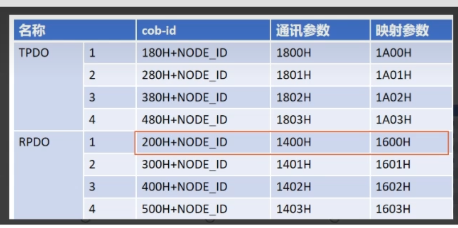

# PDO通信详解

> PDO（Process Data Object）是CANopen中用于实时数据传输的核心机制

---

## 目录

1. [PDO概述](#1-pdo概述)
2. [通信参数配置](#2-通信参数配置)
3. [映射参数配置](#3-映射参数配置)
4. [传输类型详解](#4-传输类型详解)
5. [电机控制实战](#5-电机控制实战)
6. [常见问题](#6-常见问题)

---

## 1. PDO概述

### 1.1 什么是PDO？

```
PDO = Process Data Object（过程数据对象）

核心特点：
┌─────────────────────────────────────────────────────────────┐
│  ✅ 生产者/消费者模型：发送无需确认                          │
│  ✅ 高效：无协议开销，直接映射对象字典                       │
│  ✅ 实时：低延迟，适合周期性数据                             │
│  ✅ 最大8字节：一帧CAN数据                                   │
└─────────────────────────────────────────────────────────────┘

PDO vs SDO：
┌─────────────┬───────────────────┬───────────────────┐
│   特性      │       PDO         │       SDO         │
├─────────────┼───────────────────┼───────────────────┤
│  用途       │  实时过程数据     │  配置参数读写     │
│  确认       │  无确认           │  请求/响应        │
│  数据量     │  ≤8字节           │  任意长度         │
│  效率       │  高               │  低               │
│  典型应用   │  位置/速度/电流   │  模式设置/参数    │
└─────────────┴───────────────────┴───────────────────┘
```

### 1.2 TPDO与RPDO



```
概念（以从站视角）：

┌─────────────┐                          ┌─────────────┐
│   主站      │                          │   从站      │
│  (Master)   │                          │  (Slave)    │
│             │      TPDO (0x180+n)      │             │
│  接收 ◄─────┼──────────────────────────┤  发送       │
│             │                          │             │
│  发送 ──────┼──────────────────────────►│  接收       │
│             │      RPDO (0x200+n)      │             │
└─────────────┘                          └─────────────┘

TPDO（Transmit PDO）：
- 从站发送，主站接收
- 用于上报状态数据（位置、速度、电流等）
- COB-ID范围：0x180+NodeID ~ 0x480+NodeID

RPDO（Receive PDO）：
- 主站发送，从站接收
- 用于下发控制指令（目标位置、速度等）
- COB-ID范围：0x200+NodeID ~ 0x500+NodeID

每个节点最多支持4路TPDO和4路RPDO：
┌──────────┬───────────────┬───────────────┐
│  PDO编号 │   TPDO COB-ID │   RPDO COB-ID │
├──────────┼───────────────┼───────────────┤
│  PDO0    │   0x180+ID    │   0x200+ID    │
│  PDO1    │   0x280+ID    │   0x300+ID    │
│  PDO2    │   0x380+ID    │   0x400+ID    │
│  PDO3    │   0x480+ID    │   0x500+ID    │
└──────────┴───────────────┴───────────────┘
```

### 1.3 PDO工作原理

```
┌─────────────────────────────────────────────────────────────┐
│                                                             │
│  发送端（TPDO）                                             │
│  ┌─────────────┐    ┌─────────────┐    ┌─────────────┐    │
│  │ 对象字典    │    │ 映射表      │    │ CAN帧       │    │
│  │ OD[0x6000]  │───►│ 0x6000:01   │───►│ Data[0..3]  │    │
│  │ = 0x1234    │    │ = 32bit     │    │ = 12 34 00  │    │
│  └─────────────┘    └─────────────┘    └─────────────┘    │
│                                                             │
│  接收端（RPDO）                                             │
│  ┌─────────────┐    ┌─────────────┐    ┌─────────────┐    │
│  │ CAN帧       │    │ 映射表      │    │ 对象字典    │    │
│  │ Data[0..3]  │───►│ 0x6000:01   │───►│ OD[0x6000]  │    │
│  │ = 12 34 00  │    │ = 32bit     │    │ = 0x1234    │    │
│  └─────────────┘    └─────────────┘    └─────────────┘    │
│                                                             │
│  关键点：                                                   │
│  - PDO不携带Index/SubIndex，靠映射表解析                    │
│  - 发送和接收使用相同的映射约定                             │
│  - 数据直接写入对象字典，应用层可直接读取                   │
└─────────────────────────────────────────────────────────────┘
```

---

## 2. 通信参数配置

### 2.1 索引分配

```
通信参数索引：
┌──────────────┬──────────────────────┬──────────────────────┐
│   PDO类型    │  通信参数起始索引    │  说明                │
├──────────────┼──────────────────────┼──────────────────────┤
│  RPDO n      │  0x1400 + n          │  接收PDO通信参数     │
│  TPDO n      │  0x1800 + n          │  发送PDO通信参数     │
└──────────────┴──────────────────────┴──────────────────────┘

其中 n = 0, 1, 2, 3（对应4路PDO）
```

### 2.2 子索引详解

```
通信参数子索引结构：

┌──────────┬──────────────────────┬──────────────────────────────────┐
│  SubIndex│  参数名              │  含义                            │
├──────────┼──────────────────────┼──────────────────────────────────┤
│  1       │  COB-ID              │  PDO的CAN报文标识符               │
│  2       │  Transmission Type   │  触发类型（见4.传输类型详解）      │
│  3       │  Inhibit Time        │  抑制时间，单位100µs              │
│  4       │  Reserved            │  保留                             │
│  5       │  Event Timer         │  事件定时器，单位ms               │
│  6       │  SYNC Start Value    │  同步起始值（仅同步PDO）          │
└──────────┴──────────────────────┴──────────────────────────────────┘
```

### 2.3 COB-ID字段详解

```
COB-ID（32位）结构：

┌─────────────────────────────────────────────────────────────┐
│  Bit 31    │  Bit 30      │  Bit 29      │  Bit 10:0       │
│  Valid     │  RTR         │  Frame       │  CAN-ID         │
│  (有效位)  │  (远程帧)    │  (帧格式)    │  (11位标识符)   │
└─────────────────────────────────────────────────────────────┘

- Bit 31 = 0：PDO有效（启用）
- Bit 31 = 1：PDO无效（禁用）
- Bit 30 = 0：禁止远程帧
- Bit 29 = 0：标准帧（11位ID）

禁用PDO示例（修改COB-ID前必须先禁用）：
  写入 0x80000185 → Bit31=1，禁用TPDO0（COB-ID=0x185）

启用PDO示例：
  写入 0x00000185 → Bit31=0，启用TPDO0（COB-ID=0x185）
```

### 2.4 配置步骤

```
修改PDO通信参数的正确顺序：

1. 禁用PDO（修改COB-ID的Bit31为1）
2. 修改通信参数（Transmission Type、Inhibit Time等）
3. 重新启用PDO（修改COB-ID的Bit31为0）

SDO命令示例（节点ID=5，配置TPDO0）：

# 1. 禁用TPDO0
sdo_write 0x1800 01 0x80000185 4

# 2. 设置传输类型为254（事件触发）
sdo_write 0x1800 02 0xFE 1

# 3. 设置抑制时间为10ms（100×100µs）
sdo_write 0x1800 03 0x64 2

# 4. 设置事件定时器为10ms
sdo_write 0x1800 05 0x0A 2

# 5. 重新启用TPDO0
sdo_write 0x1800 01 0x00000185 4
```

---

## 3. 映射参数配置

### 3.1 索引分配

```
映射参数索引：
┌──────────────┬──────────────────────┬──────────────────────┐
│   PDO类型    │  映射参数起始索引    │  说明                │
├──────────────┼──────────────────────┼──────────────────────┤
│  RPDO n      │  0x1600 + n          │  接收PDO映射参数     │
│  TPDO n      │  0x1A00 + n          │  发送PDO映射参数     │
└──────────────┴──────────────────────┴──────────────────────┘

其中 n = 0, 1, 2, 3（对应4路PDO）
```

### 3.2 映射项格式

```
每个映射项为32位，编码格式：

┌─────────────────────────────────────────────────────────────┐
│  Bit 31:24    │  Bit 23:16     │  Bit 15:0                 │
│  数据长度     │  子索引        │  对象字典索引             │
│  (Bit Length) │  (SubIndex)    │  (OD Index)               │
└─────────────────────────────────────────────────────────────┘

示例：
映射项 = 0x20000120
  - 对象字典索引 = 0x2000
  - 子索引 = 0x01
  - 数据长度 = 0x20 = 32位

映射项 = 0x10200110
  - 对象字典索引 = 0x2001
  - 子索引 = 0x00
  - 数据长度 = 0x10 = 16位

常用数据长度值：
┌──────────────┬──────────────┐
│  十六进制    │  位数/字节数 │
├──────────────┼──────────────┤
│  0x08        │  8位 = 1字节 │
│  0x10        │  16位 = 2字节│
│  0x20        │  32位 = 4字节│
└──────────────┴──────────────┘
```

### 3.3 映射参数子索引

```
映射参数结构：

SubIndex 0：映射项数量 N
  - 值为0表示无映射
  - 最大值取决于PDO数据域大小（8字节=64位）

SubIndex 1 ~ N：映射项
  - 每项32位，格式如上

示例：将以下两个变量映射到TPDO0
  - OD[0x6000, 01]：当前位置，32位
  - OD[0x6001, 00]：当前速度，16位

配置：
  0x1A00.sub0 = 2              # 2个映射项
  0x1A00.sub1 = 0x20600001     # 0x6000:01, 32位
  0x1A00.sub2 = 0x10600100     # 0x6001:00, 16位
```

### 3.4 配置步骤

```
修改PDO映射参数的正确顺序：

1. 禁用PDO（修改通信参数COB-ID的Bit31为1）
2. 将映射项数量设为0（清除原有映射）
3. 逐项设置新的映射
4. 设置映射项数量
5. 重新启用PDO

SDO命令示例（配置TPDO0映射）：

# 1. 禁用TPDO0
sdo_write 0x1800 01 0x80000185 4

# 2. 清除映射
sdo_write 0x1A00 00 0x00 1

# 3. 添加映射项1：OD[0x6000,01] 32位
sdo_write 0x1A00 01 0x20600001 4

# 4. 添加映射项2：OD[0x6001,00] 16位
sdo_write 0x1A00 02 0x10600100 4

# 5. 设置映射数量为2
sdo_write 0x1A00 00 0x02 1

# 6. 重新启用TPDO0
sdo_write 0x1800 01 0x00000185 4
```

---

## 4. 传输类型详解

### 4.1 传输类型分类

```
Transmission Type（传输类型）决定了PDO何时发送/接收：

┌──────────────┬──────────────────────────────────────────────────┐
│  类型值      │  触发方式                                        │
├──────────────┼──────────────────────────────────────────────────┤
│  0           │  非周期同步：收到SYNC后立即发送                  │
│  1~240       │  周期同步：每N个SYNC后发送一次                   │
│  241~253     │  保留                                            │
│  254         │  事件触发：由应用程序或硬件事件触发              │
│  255         │  事件触发+抑制时间：事件触发但受抑制时间限制     │
└──────────────┴──────────────────────────────────────────────────┘
```

### 4.2 同步传输

```
同步传输模式（类型0~240）：

┌─────────────────────────────────────────────────────────────┐
│                                                             │
│  SYNC   SYNC   SYNC   SYNC   SYNC   SYNC   SYNC            │
│    │      │      │      │      │      │      │             │
│    ▼      ▼      ▼      ▼      ▼      ▼      ▼             │
│  ──┬──────┬──────┬──────┬──────┬──────┬──────┬── 时间轴    │
│    │      │      │      │      │      │      │             │
│  类型=1：每个SYNC后发送                                     │
│  ──┬─────────────┬─────────────┬─────────────┬──           │
│    │  TPDO发送   │  TPDO发送   │  TPDO发送   │             │
│                                                             │
│  类型=3：每3个SYNC后发送                                    │
│  ──┬─────────────────────────────┬───────────────────      │
│    │         TPDO发送            │         TPDO发送        │
│                                                             │
│  类型=0：收到SYNC后立即发送（由事件触发）                    │
│                                                             │
└─────────────────────────────────────────────────────────────┘

同步传输适合：
- 需要精确时序的多轴协调控制
- 需要同步采样的传感器数据
```

### 4.3 事件触发传输

```
事件触发模式（类型254、255）：

┌─────────────────────────────────────────────────────────────┐
│                                                             │
│  触发条件（满足任一）：                                       │
│  - 应用程序主动调用发送函数                                  │
│  - 映射的变量值发生变化                                      │
│  - 定时器到期（Event Timer）                                 │
│                                                             │
│  类型254：纯事件触发                                         │
│  ──┬──────┬──────────┬──────┬──────┬── 时间轴              │
│    │发送  │          │发送  │发送  │                        │
│    │(事件)│          │(事件)│(定时)│                        │
│                                                             │
│  类型255：事件触发+抑制时间                                  │
│  ──┬──┬──┬──────────┬──┬──┬── 时间轴                       │
│    │  │  │          │  │  │                                 │
│    │  │  │          │  │  └─ 发送（抑制时间到）              │
│    │  │  └──────────┘  └─ 事件被抑制                        │
│    │  └─ 事件被抑制                                          │
│    └─ 发送（抑制时间到）                                     │
│                                                             │
│  抑制时间（Inhibit Time）：                                  │
│  - 单位：100µs                                              │
│  - 作用：防止PDO发送过于频繁                                 │
│  - 例：值=100 → 最小间隔10ms                                │
│                                                             │
│  事件定时器（Event Timer）：                                 │
│  - 单位：ms                                                 │
│  - 作用：即使没有事件触发，也定时发送                        │
│  - 例：值=100 → 每100ms至少发送一次                         │
│                                                             │
└─────────────────────────────────────────────────────────────┘

事件触发适合：
- 数据变化驱动的传感器
- 用户输入驱动的控制
```

---

## 5. 电机控制实战

### 5.1 典型电机控制PDO配置

```
电机控制常用的PDO映射方案：

┌─────────────┬────────────────────────────────────────────────┐
│   PDO       │                  数据内容                       │
├─────────────┼────────────────────────────────────────────────┤
│  RPDO0      │  控制字(16bit) + 目标位置(32bit)               │
│  RPDO1      │  目标速度(32bit) + 目标扭矩(16bit)             │
│  TPDO0      │  状态字(16bit) + 实际位置(32bit)               │
│  TPDO1      │  实际速度(32bit) + 实际电流(16bit)             │
└─────────────┴────────────────────────────────────────────────┘

常见对象字典索引（CiA 402驱动协议）：
┌──────────────┬──────────────────────────────────────────────┐
│  索引        │  含义                                        │
├──────────────┼──────────────────────────────────────────────┤
│  0x6040      │  控制字（Controlword）                        │
│  0x6041      │  状态字（Statusword）                         │
│  0x6060      │  运行模式（Modes of Operation）               │
│  0x6061      │  运行模式显示                                 │
│  0x607A      │  目标位置（Target Position）                  │
│  0x60FF      │  目标速度（Target Velocity）                  │
│  0x6071      │  目标扭矩（Target Torque）                    │
│  0x6064      │  实际位置（Position Actual）                  │
│  0x606C      │  实际速度（Velocity Actual）                  │
│  0x6078      │  实际电流（Current Actual）                   │
└──────────────┴──────────────────────────────────────────────┘
```

### 5.2 Python实现

```python
import can
import struct
import time

class MotorPDOController:
    """基于PDO的电机控制器"""

    def __init__(self, bus, node_id):
        self.bus = bus
        self.node_id = node_id

        # COB-ID
        self.rpdo0 = 0x200 + node_id  # 主站→从站
        self.rpdo1 = 0x300 + node_id
        self.tpdo0 = 0x180 + node_id  # 从站→主站
        self.tpdo1 = 0x280 + node_id

    def send_position_command(self, control_word, target_position):
        """发送位置控制RPDO0：控制字(16bit) + 目标位置(32bit)"""
        data = struct.pack('<Hi', control_word, target_position)
        msg = can.Message(arbitration_id=self.rpdo0, data=data)
        self.bus.send(msg)

    def send_velocity_command(self, target_velocity, target_torque=0):
        """发送速度控制RPDO1：目标速度(32bit) + 目标扭矩(16bit)"""
        data = struct.pack('<Ih', target_velocity, target_torque)
        msg = can.Message(arbitration_id=self.rpdo1, data=data)
        self.bus.send(msg)

    def recv_status(self, timeout=0.01):
        """接收TPDO0：状态字(16bit) + 实际位置(32bit)"""
        msg = self.bus.recv(timeout=timeout)
        if msg and msg.arbitration_id == self.tpdo0:
            status_word, actual_pos = struct.unpack('<Hi', msg.data[:6])
            return status_word, actual_pos
        return None, None

    def recv_feedback(self, timeout=0.01):
        """接收TPDO1：实际速度(32bit) + 实际电流(16bit)"""
        msg = self.bus.recv(timeout=timeout)
        if msg and msg.arbitration_id == self.tpdo1:
            actual_vel, actual_cur = struct.unpack('<Ih', msg.data[:6])
            return actual_vel, actual_cur
        return None, None


# 使用示例
bus = can.interface.Bus(channel='can0', bustype='socketcan')
motor = MotorPDOController(bus, node_id=1)

# 发送位置指令
motor.send_position_command(control_word=0x000F, target_position=100000)

# 读取状态
status, position = motor.recv_status()
print(f"状态字: 0x{status:04X}, 位置: {position}")

bus.shutdown()
```

### 5.3 C++实现

```cpp
#include <stdio.h>
#include <stdlib.h>
#include <string.h>
#include <unistd.h>
#include <net/if.h>
#include <sys/ioctl.h>
#include <sys/socket.h>
#include <linux/can.h>
#include <linux/can/raw.h>

// RPDO0: 控制字(2字节) + 目标位置(4字节)
struct RPDO0 {
    uint16_t control_word;
    int32_t target_position;
} __attribute__((packed));

// TPDO0: 状态字(2字节) + 实际位置(4字节)
struct TPDO0 {
    uint16_t status_word;
    int32_t actual_position;
} __attribute__((packed));

int main() {
    int s = socket(PF_CAN, SOCK_RAW, CAN_RAW);
    struct sockaddr_can addr;
    struct ifreq ifr;

    strcpy(ifr.ifr_name, "can0");
    ioctl(s, SIOCGIFINDEX, &ifr);
    addr.can_family = AF_CAN;
    addr.can_ifindex = ifr.ifr_ifindex;
    bind(s, (struct sockaddr *)&addr, sizeof(addr));

    // 配置过滤器：只接收TPDO0 (0x180 + node_id)
    struct can_filter rfilter;
    rfilter.can_id = 0x181;  // node_id=1
    rfilter.can_mask = 0x7FF;
    setsockopt(s, SOL_CAN_RAW, CAN_RAW_FILTER, &rfilter, sizeof(rfilter));

    // 发送RPDO0
    struct can_frame frame;
    frame.can_id = 0x201;  // RPDO0, node_id=1
    frame.can_dlc = 6;

    RPDO0 cmd;
    cmd.control_word = 0x000F;
    cmd.target_position = 100000;
    memcpy(frame.data, &cmd, 6);
    write(s, &frame, sizeof(frame));

    // 接收TPDO0
    int nbytes = read(s, &frame, sizeof(frame));
    if (nbytes > 0) {
        TPDO0 status;
        memcpy(&status, frame.data, 6);
        printf("状态字: 0x%04X, 位置: %d\n",
               status.status_word, status.actual_position);
    }

    close(s);
    return 0;
}
```

### 5.4 配置PDO的完整流程

```
以配置电机TPDO0为例（节点ID=1，上报位置和速度）：

步骤1：确定映射内容
  - 状态字 0x6041:00, 16位
  - 实际位置 0x6064:00, 32位
  - 实际速度 0x606C:00, 16位
  总计：16+32+16 = 64位 = 8字节（刚好一帧）

步骤2：SDO配置命令

# 设置运行模式为轮廓位置模式
cansend can0 601#2F60600001000000

# 禁用TPDO0
cansend can0 601#4000180100000000        # 读取当前COB-ID
cansend can0 601#2300180100000080        # 写入禁用值

# 清除映射
cansend can0 601#2F001A0000000000        # 映射数量=0

# 添加映射项
cansend can0 601#23011A0041600010        # 0x6041:00, 16位
cansend can0 601#23021A0064600020        # 0x6064:00, 32位
cansend can0 601#23031A006C600010        # 0x606C:00, 16位

# 设置映射数量
cansend can0 601#2F001A0003000000        # 映射数量=3

# 设置传输类型（事件触发）
cansend can0 601#2F021800FE000000        # Transmission Type=254

# 设置事件定时器（10ms）
cansend can0 601#2B0518000A000000        # Event Timer=10ms

# 重新启用TPDO0
cansend can0 601#2300180181010000        # COB-ID=0x181, 启用
```

---

## 6. 常见问题

### Q1: PDO和SDO能同时使用吗？

**A**: 可以。SDO用于配置参数，PDO用于实时数据传输，两者互不影响。通常在初始化阶段用SDO配置PDO映射，运行阶段用PDO传输数据。

### Q2: 修改PDO映射失败？

**A**: 必须按照正确顺序：
1. 先禁用PDO（设置COB-ID的Bit31=1）
2. 设置映射数量为0
3. 逐项添加映射
4. 设置映射数量
5. 重新启用PDO

跳过任何步骤都会导致配置失败。

### Q3: TPDO不发送数据？

**A**: 检查以下几点：
1. COB-ID的Bit31是否为0（启用状态）
2. 传输类型是否正确设置
3. 如果是事件触发，检查Event Timer是否大于0
4. 如果是同步模式，检查SYNC是否正常发送
5. 检查映射的对象字典索引是否存在

### Q4: PDO数据解析错误？

**A**: 确认以下几点：
1. 发送端和接收端的映射配置必须一致
2. 数据长度必须匹配（映射的总位数）
3. 字节序必须一致（CANopen使用小端模式）

### Q5: 如何提高PDO通信实时性？

**A**:
1. 使用同步传输模式，配合SYNC报文
2. 减小Event Timer值
3. 合理设置Inhibit Time
4. 减少不必要的PDO数量
5. 增大传输队列：`ip link set can0 txqueuelen 1000`

---

## 下一步

学习完PDO通信后，进入 [ROS与CAN集成](05-ROS与CAN集成.md) 了解ROS系统集成。
