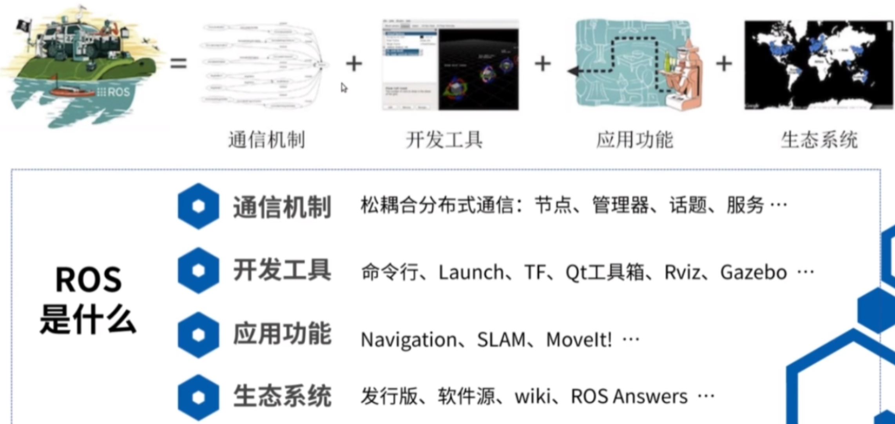
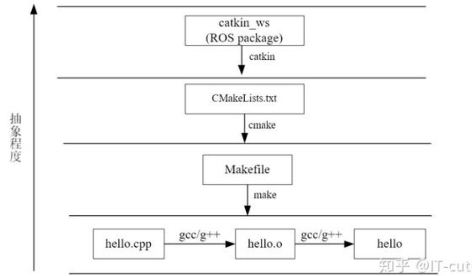
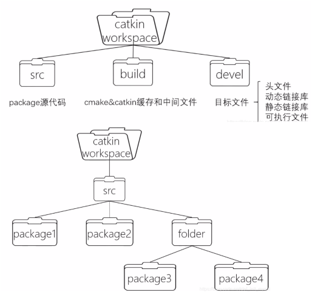
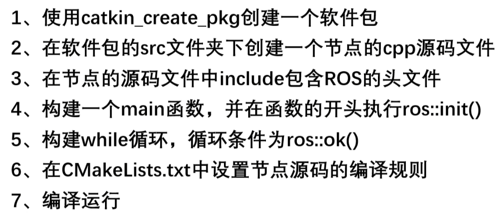
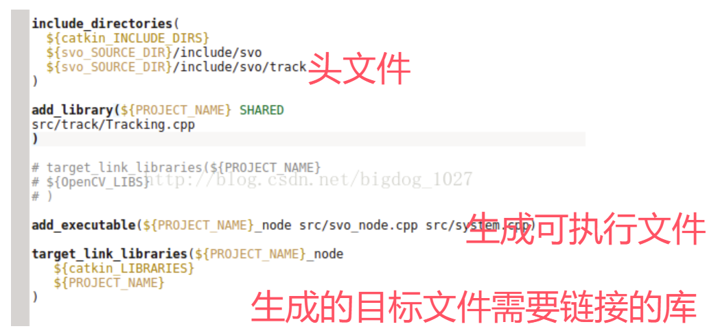
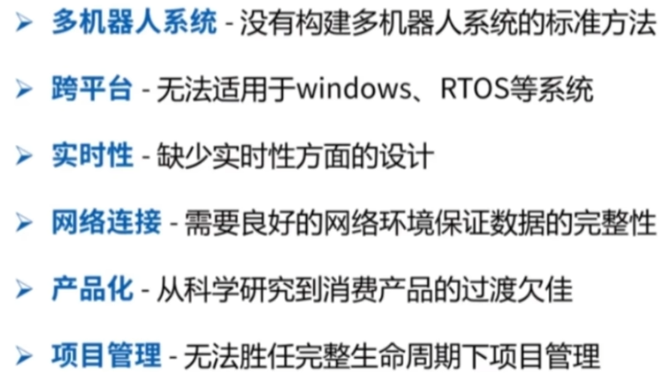

# ROS基础入门与环境搭建

---

# 一、ROS是什么？

ROS（Robot Operating System，机器人操作系统）是一个用于编写机器人软件的**框架**。它不是传统意义上的操作系统，而是一套帮助你快速构建机器人应用的工具和库。

**为什么需要ROS？**
- 机器人软件涉及很多模块：感知、规划、控制、通信……如果每个模块都从零写，工作量巨大
- ROS提供了标准化的通信机制，让不同模块可以像"搭积木"一样组合
- 社区有大量现成的功能包可以直接使用（导航、SLAM、机械臂控制等）

---

## ROS的组成
ROS = 通讯机制+开发工具+应用功能+ROS生态系统


### 通信机制
ROS的通信机制是一种松耦合分布式通信。主要概念有：
1. **节点（Node）**：软件模块，一个可执行程序就是一个节点
2. **节点管理器（ROS Master）**：控制中心，提供参数管理，所有节点通过它互相发现
3. **话题（Topic）**：异步通信机制，传输message，适用于数据传输（如传感器数据）
4. **服务（Service）**：同步通信机制，传输请求应答数据，适用于逻辑处理（如开关某个功能）
5. **动作（Action）**：底层就是话题，拥有监控和取消任务功能（如导航任务）

### 开发工具
1. **命令行 & 编译器**：rosrun、roslaunch、catkin_make 等
2. **launch文件**：通过XML文件实现多节点的配置和启动，自动启动ros master
3. **TF坐标变换库**：管理机器人各坐标系之间的关系
4. **QT工具箱（rqt）**：可视化调试工具集
5. **Rviz**：三维可视化工具，**显示**机器人状态和传感器数据
6. **Gazebo**：独立于ROS，但提供了ROS接口，三维物理仿真平台，**创造**仿真数据

> **Rviz vs Gazebo 的区别**：Rviz是"显示器"——把已有数据可视化；Gazebo是"模拟器"——虚拟一个机器人和物理环境来产生数据。

### 应用功能
1. **导航框架（Navigation）**：让机器人自主移动到目标点
2. **SLAM**：即时定位与建图，让机器人在未知环境中建立地图并定位自身
3. **MoveIt!**：机械臂运动规划框架
4. **SMACH**：任务级状态机，管理复杂的任务流程

### ROS生态系统
ROS拥有庞大的社区生态，包括官方教程、第三方功能包、各种机器人平台的支持等。

---

# 二、ROS安装与快速体验

## 安装（以Ubuntu + ROS Noetic为例）

```bash
# 1. 设置ROS软件源
sudo sh -c 'echo "deb http://packages.ros.org/ros/ubuntu $(lsb_release -sc) main" > /etc/apt/sources.list.d/ros-latest.list'

# 2. 添加密钥
sudo apt-key adv --keyserver 'hkp://keyserver.ubuntu.com:80' --recv-key C1CF6E31E6BADE8868B172B4F42ED6FBAB17C654

# 3. 更新并安装
sudo apt update
sudo apt install ros-noetic-desktop-full

# 4. 初始化rosdep
sudo rosdep init
rosdep update

# 5. 设置环境变量（每次打开终端自动加载）
echo "source /opt/ros/noetic/setup.bash" >> ~/.bashrc
source ~/.bashrc
```

## 第一次运行ROS

```bash
# 终端1：启动ROS核心
roscore

# 终端2：运行一个小海龟仿真（ROS自带的经典示例）
rosrun turtlesim turtlesim_node

# 终端3：用键盘控制海龟移动
rosrun turtlesim turtle_teleop_key
```

如果小海龟能动，说明ROS安装成功！

## 安装软件包

ROS软件包有两种获取方式：

**方式一：apt安装（推荐新手）**
```bash
sudo apt install ros-noetic-xxxxx
```
安装好的包在 `/opt/ros/noetic/share` 中，是编译好的可执行文件。

**方式二：源码编译**
从GitHub下载到工作空间的 `src` 中，用catkin自己编译。

> **什么是软件包？** 软件包（Package）是ROS代码的基本组织单元。不是所有软件包都有可执行节点，很多是依赖性质的基础包，例如 `std_msgs`（标准消息类型）等。

---

# 三、编译系统

**新手须知：** 你写的代码（C++/Python）需要"翻译"成计算机能执行的程序，这个过程叫**编译**。ROS使用catkin工具来管理这个过程，你只需要记住一个命令：`catkin_make`。

---

代码变成可执行文件，叫做编译（compile）；先编译这个，还是先编译那个（即编译的安排），叫做构建（build）。Make是最常用的构建工具。
makefile定义了一系列的规则来指定哪些文件需要先编译，哪些文件需要后编译，哪些文件需要重新编译，甚至于进行更复杂的功能操作，Make命令依赖makefile进行构建，make解释makefile中的命令

CMake是一个跨平台的安装（编译）工具，可以用简单的语句来描述所有平台的安装(编译过程)。他能够输出各种各样的makefile或者project文件。
catkin是ROS定制的编译构建系统，对CMake的扩展。支持大体量工作。工作空间是一个文件夹，以catkin工具进行编译构建。Catkin就是将cmake与make指令做了一个封装从而完成整个编译过程的工具。



编译命令是在工作空间下 `catkin_make`

# 四、文件系统

ROS的 Catkin 编译系统的一个特点是将程序做成 package（称为 catkin package 或者 ROS package）的形式，可以理解成模块化，一个包可能会有很多个节点（node）。

典型的 ROS workspace 中包含 `src`、`build`、`devel` 三个文件夹：
- `src`：源代码目录，你写的代码放这里
- `build`：编译中间文件，自动生成
- `devel`：编译结果，可执行文件和环境变量

在分享时只需要分享 `src` 中的某个 package 即可，所有的编译信息都在此 package 中。



---

# 五、创建工作空间与功能包

## 1、创建一个工作空间
Catkin工作空间是创建、修改、编译catkin软件包的目录。catkin的工作空间，直观的形容就是一个仓库，里面装载着ROS的各种项目工程，便于系统组织管理调用。在可视化图形界面里是一个文件夹。我们自己写的ROS代码通常就放在工作空间中。

```bash
mkdir catkin_ws        # 自己定义工作空间，名称随意
cd catkin_ws
mkdir src
catkin_init_workspace   # 初始化之后目录中多了CMakeLists.txt，说明当前路径是ROS工作空间
cd ~/catkin_ws
catkin_make             # 编译src下面所有功能包的源码，工作空间下会多出build和devel
```

## 2、创建功能包（软件包）
```bash
catkin_create_pkg 包名 依赖（一般有 rospy roscpp std_msgs）
```
创建后 `src` 中会出现一个包，包中 `include` 放置头文件，`src` 放置功能包代码。
`CMakeLists.txt` 和 `package.xml` 是每个catkin软件包必须要存在的两个文件。

回到工作空间执行：
```bash
catkin_make
```

## 3、设置环境变量
每次运行前需要source一下：
```bash
source ~/catkin_ws/devel/setup.bash
```
或者直接在 `~/.bashrc` 中添加这行，这样每次打开终端都会自动设置：
```bash
echo "source ~/catkin_ws/devel/setup.bash" >> ~/.bashrc
```

## 4、构建一个节点



## 5、运行节点
```bash
# 终端1：必须先启动roscore
roscore

# 终端2：运行节点
rosrun 软件包名 生成的节点名
```

---

# 六、从机械臂视角来看ROS

如果你的目标是控制机械臂，那么ROS中你需要关注的部分是：

| 类别 | 具体内容 |
|------|----------|
| 通信机制 | 节点、话题通信、服务通信、参数服务器 |
| 开发工具 | launch、Rviz、rqt、Gazebo、tf |
| 应用功能 | MoveIt! |
| 生态系统 | MoveIt API、官方教程、机器人功能包 |

---

# 七、ROS的局限性


ROS1 存在一些设计上的局限：
- **实时性差**：基于TCP/UDP通信，无法保证硬实时
- **单点故障**：依赖ROS Master，Master挂了整个系统瘫痪
- **跨平台差**：主要支持Linux
- **安全性弱**：没有认证和加密机制

这些问题在ROS2中得到了改进，详见 `ROS2/对比ROS1.md`。

---

# 八、常用命令速查

```bash
# ROS核心
roscore                          # 启动ROS Master

# 节点操作
rosrun <包名> <节点名>            # 运行节点
rosnode list                     # 查看所有运行中的节点
rosnode info <节点名>             # 查看节点信息

# 话题操作
rostopic list                    # 查看所有话题
rostopic echo <话题名>            # 打印话题数据
rostopic pub <话题名> <类型> <数据> # 手动发布话题

# 服务操作
rosservice list                  # 查看所有服务
rosservice call <服务名> <参数>    # 调用服务

# 参数操作
rosparam list                    # 查看所有参数
rosparam get <参数名>             # 获取参数值
rosparam set <参数名> <值>        # 设置参数值

# launch文件
roslaunch <包名> <launch文件名>   # 启动launch文件

# 编译
cd ~/catkin_ws && catkin_make    # 编译工作空间

# 环境变量
source ~/catkin_ws/devel/setup.bash  # 设置环境变量
```
