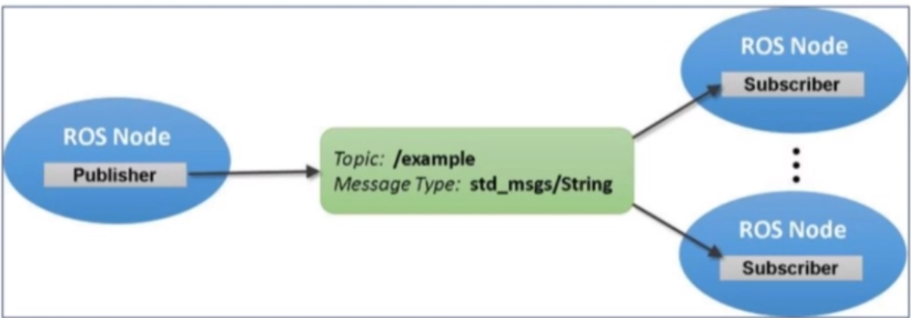
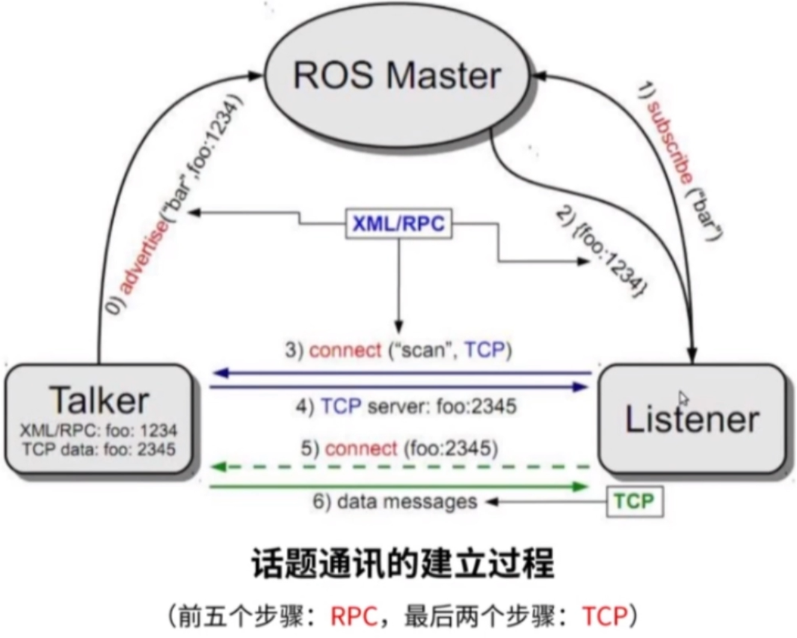
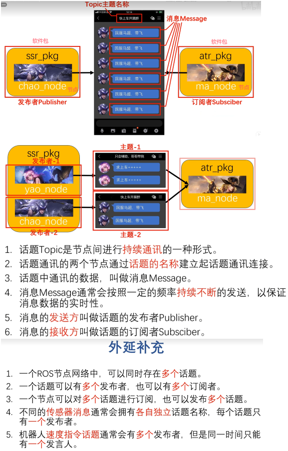
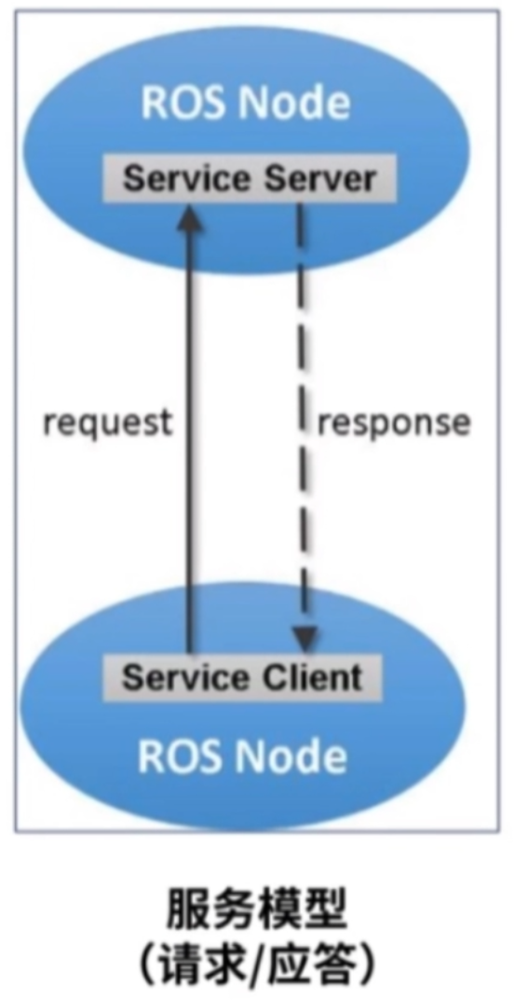
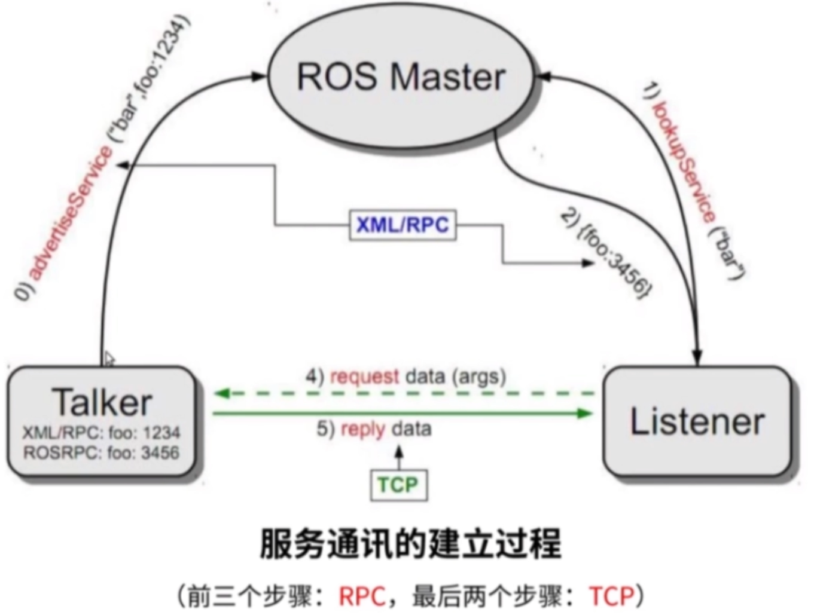
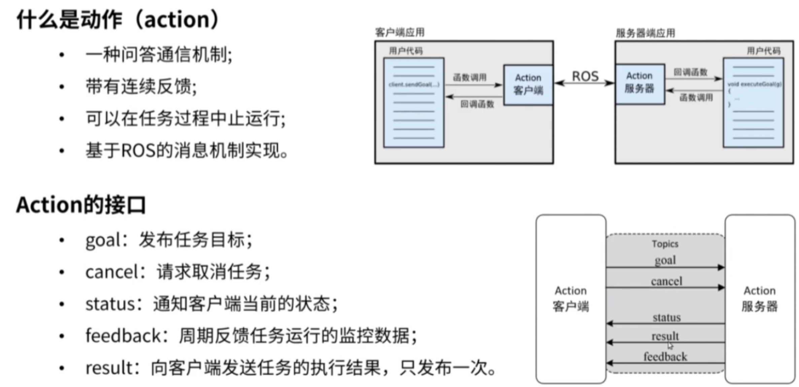
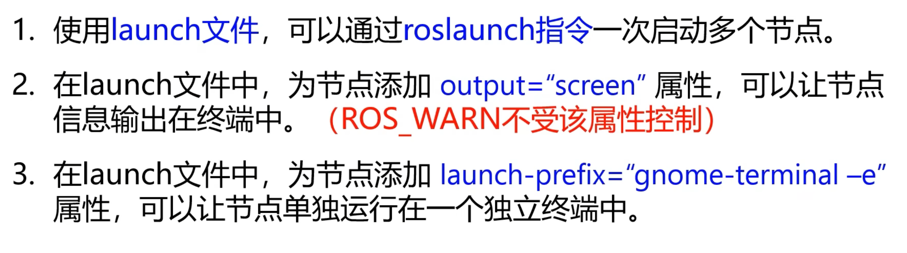

# ROS通信机制

本章详细介绍ROS的几种通信方式，这是理解ROS的核心。建议先完成《01-ROS基础入门》后再学习本章。

---

# 一、通信架构总览

ROS的通信机制是**松耦合、分布式**的——各个节点可以运行在不同的机器上，通过ROS Master互相发现后直接通信。

```
┌──────────┐     注册      ┌──────────────┐     注册      ┌──────────┐
│ 发布者A  │ ──────────→ │  ROS Master  │ ←────────── │ 订阅者B  │
│ (Sensor) │              │  (roscore)   │              │ (Planner)│
└────┬─────┘              └──────────────┘              └────┬─────┘
     │                                                       │
     │          ┌──────────────────────────────┐             │
     └────────→│     Topic: /sensor_data       │←────────────┘
                │     Type: sensor_msgs/LaserScan│
                └──────────────────────────────┘
```

**核心概念：**
- **节点（Node）**：ROS中的可执行程序单元，一个机器人系统由多个节点组成
- **ROS Master**：节点管理器，帮助节点互相发现（注册和查找），节点之间直接通信
- **话题（Topic）**：命名的通信通道，节点通过话题收发数据
- **消息（Message）**：话题中传输的数据结构

---

# 二、话题通信（Topic）—— 最常用的通信方式

## 什么是话题通信？

话题通信是ROS中**最常用**的通信方式，采用**发布-订阅**模型：
- **发布者（Publisher）**：往某个话题上发送数据
- **订阅者（Subscriber）**：从某个话题上接收数据
- 一个话题可以有多个发布者和多个订阅者
- 发布者和订阅者之间是**异步**的，发布者不需要等待订阅者




## 消息类型

话题中传输的数据必须有固定的格式，叫做**消息类型**。ROS自带了很多常用的消息类型：

```bash
# 查看所有已安装的消息类型
rosmsg list

# 查看某个消息类型的定义
rosmsg show std_msgs/String
```

常用的消息包：
- `std_msgs`：标准消息包（String、Int32、Float64、Bool等基本类型）
- `geometry_msgs`：几何消息（Twist速度、Pose位姿、Point点等）
- `sensor_msgs`：传感器消息（LaserScan激光、Image图像、Imu惯导等）
- `nav_msgs`：导航消息（Odometry里程计、Path路径等）

## 话题操作命令

```bash
# 查看当前所有话题
rostopic list

# 查看话题的消息类型
rostopic type /话题名

# 实时打印话题数据
rostopic echo /话题名

# 查看话题发布频率
rostopic hz /话题名

# 手动向话题发布数据（用于测试）
rostopic pub /话题名 消息类型 "数据"
# 例如：
rostopic pub /cmd_vel geometry_msgs/Twist "linear:
  x: 0.5
  y: 0.0
  z: 0.0
angular:
  x: 0.0
  y: 0.0
  z: 0.0"
```

## 代码示例

**发布者（Python）：**
```python
#!/usr/bin/env python3
import rospy
from std_msgs.msg import String

rospy.init_node('talker')                    # 初始化节点
pub = rospy.Publisher('chatter', String, queue_size=10)  # 创建发布者
rate = rospy.Rate(10)                        # 10Hz

while not rospy.is_shutdown():
    pub.publish("Hello ROS!")                # 发布消息
    rate.sleep()
```

**订阅者（Python）：**
```python
#!/usr/bin/env python3
import rospy
from std_msgs.msg import String

def callback(msg):
    rospy.loginfo("Received: %s", msg.data)  # 收到消息时的回调

rospy.init_node('listener')                   # 初始化节点
rospy.Subscriber('chatter', String, callback) # 创建订阅者
rospy.spin()                                  # 保持运行
```

> ROS中C++和Python的代码写法都有，发布者和订阅者ros中都提供了标准模板。
> 

---

# 三、服务通信（Service）—— 请求-应答模式

## 什么是服务通信？

话题通信是单向的"广播"，而服务通信是**双向的请求-应答**：
- **客户端（Client）**：发送请求，等待响应
- **服务端（Server）**：接收请求，返回结果
- 适用于一次性的操作，如查询状态、触发某个动作




## 服务操作命令

```bash
# 查看所有服务
rosservice list

# 调用服务
rosservice call /服务名 "参数"

# 例如：让小海龟重置位置
rosservice call /reset

# 查看服务类型
rosservice type /服务名
```

## 自定义服务文件

服务由**请求**和**响应**两部分组成，定义在 `.srv` 文件中：
```
# 示例：AddTwoInts.srv
int64 a          # 请求部分
int64 b
---              # 分隔符
int64 sum        # 响应部分
```

---

# 四、动作通信（Action）—— 带反馈的长任务

## 什么是动作通信？

动作通信用于**耗时较长**的任务，它在话题通信的基础上增加了**反馈**和**取消**功能：
- **客户端**：发送目标，可以取消任务，实时查看进度
- **服务端**：执行任务，定期反馈进度



## 典型应用场景
- 导航任务：机器人移动到目标点，途中可以取消，实时反馈距离
- 机械臂运动：MoveIt规划轨迹并执行，反馈执行进度

## 动作的三个组成部分
1. **Goal（目标）**：客户端发送的目标值
2. **Feedback（反馈）**：服务端定期发送的执行进度
3. **Result（结果）**：任务完成后的最终结果

---

# 五、参数服务器（Parameter Server）

## 什么是参数服务器？

参数服务器是ROS Master提供的**全局共享参数存储**，所有节点都可以读写：
- 适合存储不经常变化的配置参数
- 支持的数据类型：整数、浮点、字符串、布尔、列表、字典

## 参数操作命令

```bash
# 查看所有参数
rosparam list

# 获取参数值
rosparam get /参数名

# 设置参数值
rosparam set /参数名 值

# 保存参数到文件
rosparam dump params.yaml

# 从文件加载参数
rosparam load params.yaml
```

---

# 六、通信方式对比

| 特性 | 话题（Topic） | 服务（Service） | 动作（Action） |
|------|---------------|-----------------|----------------|
| 通信模式 | 发布-订阅 | 请求-应答 | 目标-反馈-结果 |
| 方向 | 单向 | 双向 | 双向 |
| 异步 | 是 | 否（同步） | 是 |
| 适用场景 | 持续数据流 | 一次性查询 | 耗时长任务 |
| 典型例子 | 传感器数据 | 查询机器人状态 | 导航/抓取 |

**选择建议：**
- 传感器数据、状态广播 → **话题**
- 查询/设置参数、触发一次性操作 → **服务**
- 导航、运动规划等长任务 → **动作**

---

# 七、launch文件

## 为什么需要launch文件？

一个机器人系统通常有多个节点需要同时运行。如果一个一个手动 `rosrun`，非常麻烦。launch文件可以**一次性启动多个节点**，并且自动启动roscore。

> launch文件放在任意一个软件包下就行，ROS会遍历搜索运行。

## launch文件语法

launch文件使用XML格式：

```xml
<launch>
  <!-- 启动一个节点 -->
  <node pkg="包名" type="可执行文件名" name="节点名称" output="screen"/>

  <!-- 设置参数 -->
  <param name="参数名" value="值"/>

  <!-- 从yaml文件加载参数 -->
  <rosparam file="$(find 包名)/config/params.yaml" command="load"/>

  <!-- 包含其他launch文件 -->
  <include file="$(find 包名)/launch/other.launch"/>

  <!-- 设置参数变量 -->
  <arg name="arg_name" default="default_value"/>
</launch>
```

## 常用标签说明

| 标签 | 作用 | 示例 |
|------|------|------|
| `<node>` | 启动一个节点 | `<node pkg="turtlesim" type="turtlesim_node" name="my_turtle"/>` |
| `<param>` | 设置参数 | `<param name="color" value="red"/>` |
| `<rosparam>` | 加载yaml参数 | `<rosparam file="config.yaml" command="load"/>` |
| `<include>` | 包含其他launch | `<include file="$(find pkg)/launch/base.launch"/>` |
| `<arg>` | 定义参数变量 | `<arg name="gui" default="true"/>` |
| `<remap>` | 重映射话题名 | `<remap from="/old" to="/new"/>` |

## launch操作命令

```bash
# 启动launch文件（自动启动roscore）
roslaunch 包名 launch文件名.launch

# 带参数启动
roslaunch 包名 launch文件名.launch arg_name:=value
```



---

# 八、TF坐标变换

## 什么是TF？

机器人系统中有多个坐标系（如：世界坐标系、机器人基座坐标系、各关节坐标系、传感器坐标系等）。TF（Transform）库负责**管理和维护这些坐标系之间的关系**。

## TF的作用
- 自动计算任意两个坐标系之间的变换关系
- 支持随时间变化的坐标变换（如机器人移动后坐标系变化）
- 在RViz中可视化显示坐标系

## TF操作命令

```bash
# 查看当前TF树
rosrun tf view_frames

# 查看两个坐标系之间的变换
tf_echo /frame1 /frame2

# 在RViz中显示坐标系
rosrun rviz rviz  # 添加TF显示类型
```
