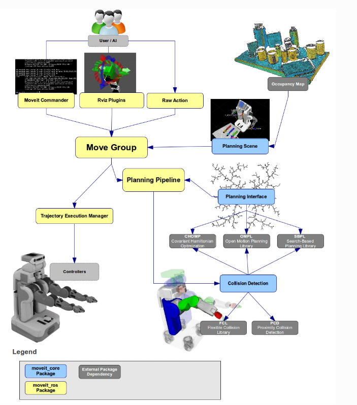

# 机器人建模与URDF

本章介绍如何用URDF描述机器人模型，并用SolidWorks导出实际机器人的URDF文件。这是使用MoveIt进行运动规划的前提。

---

# 一、URDF简介

## 什么是URDF？

URDF（Unified Robot Description Format，统一机器人描述格式）是一种XML格式的文件，用于描述机器人的**物理模型**：
- **连杆（Link）**：机器人的刚体部件（如手臂、底座）
- **关节（Joint）**：连接连杆的运动副（如旋转关节、固定关节）
- **视觉（Visual）**：在RViz/Gazebo中显示的外观模型
- **碰撞（Collision）**：用于碰撞检测的简化模型
- **惯性（Inertia）**：物理仿真需要的质量和惯性参数

## URDF的基本结构

```xml
<?xml version="1.0"?>
<robot name="my_robot">

  <!-- 定义一个连杆 -->
  <link name="base_link">
    <visual>
      <geometry>
        <cylinder length="0.6" radius="0.2"/>
      </geometry>
    </visual>
  </link>

  <!-- 定义一个关节 -->
  <joint name="base_to_arm" type="revolute">
    <parent link="base_link"/>
    <child link="arm_link"/>
    <origin xyz="0 0 0.3" rpy="0 0 0"/>
    <axis xyz="0 0 1"/>
    <limit lower="-3.14" upper="3.14" effort="100" velocity="1.0"/>
  </joint>

  <link name="arm_link">
    <visual>
      <geometry>
        <box size="0.1 0.1 0.5"/>
      </geometry>
    </visual>
  </link>

</robot>
```

**关键元素说明：**

| 元素 | 作用 |
|------|------|
| `<link>` | 定义一个刚体部件 |
| `<joint>` | 定义两个连杆之间的连接关系 |
| `<parent>` / `<child>` | 关节连接的父连杆和子连杆 |
| `<origin>` | 关节在父连杆坐标系中的位置和姿态 |
| `<axis>` | 关节的旋转轴或移动方向 |
| `<limit>` | 关节的运动范围、最大力矩和速度 |
| `<visual>` | 显示用的几何模型 |
| `<collision>` | 碰撞检测用的几何模型 |
| `<inertial>` | 物理仿真用的质量和惯性 |

## 关节类型

| 类型 | 说明 | 例子 |
|------|------|------|
| `revolute` | 旋转关节（有范围限制） | 手臂关节 |
| `continuous` | 无限旋转关节 | 轮子 |
| `prismatic` | 移动关节（有范围限制） | 直线导轨 |
| `fixed` | 固定关节（无自由度） | 底座与外壳 |
| `floating` | 六自由度关节 | 浮动基座 |
| `planar` | 平面关节 | 平面移动 |

## 在RViz中查看URDF

```bash
# 方法1：使用urdf_tutorial包
roslaunch urdf_tutorial display.launch model:=path/to/your_robot.urdf

# 方法2：在launch文件中加载
<param name="robot_description" textfile="$(find your_pkg)/urdf/robot.urdf"/>
<node name="robot_state_publisher" pkg="robot_state_publisher" type="robot_state_publisher"/>
<node name="rviz" pkg="rviz" type="rviz"/>
```

---

# 二、从SolidWorks导出URDF

## 为什么用SolidWorks？

手写URDF文件非常繁琐，尤其是复杂模型。SolidWorks提供了ROS插件，可以直接从3D模型导出URDF和网格文件。

## 导出步骤

### 1、安装SolidWorks的ROS工具
下载并安装 `sw_urdf_exporter` 插件。

### 2、在SolidWorks中设置模型
- **设置坐标轴**：注意SolidWorks中的Y轴是MoveIt中的Z轴，在SolidWorks中"朝上"应该朝Y方向设置
- **设置关节基准轴**：为每个旋转关节定义旋转轴
- **设置坐标系**：为每个连杆定义参考坐标系
- **设置连杆和旋转轴**：明确哪些部件是连杆，哪些是关节

### 3、导出URDF和Mesh
使用插件导出，生成的文件夹中，只有以下文件是有用的：
- `mesh/`：网格文件（3D模型）
- `urdf/`：URDF描述文件
- `package.xml`：ROS包描述
- `CMakeLists.txt`：编译配置

> **坐标系注意事项：** SolidWorks和ROS使用不同的坐标系约定，导出后务必在RViz中检查模型方向是否正确。

---

# 三、使用MoveIt Setup Assistant生成配置文件

MoveIt Setup Assistant是一个图形化工具，用于基于URDF生成MoveIt所需的配置文件。

## 操作步骤

### 1、准备工作
将URDF文件放在工作空间下，作为一个功能包：
```bash
cd ~/catkin_ws/src
mkdir my_robot_description
# 将URDF和mesh文件放入此包中
```

### 2、启动Setup Assistant
```bash
roslaunch moveit_setup_assistant setup_assistant.launch
```

### 3、配置流程
Setup Assistant会引导你完成以下步骤：
1. **加载URDF**：选择你的URDF文件
2. **生成碰撞矩阵**：自动计算哪些连杆之间不会碰撞
3. **添加虚拟关节**：如世界坐标系到机器人基座的连接
4. **添加规划组（Planning Group）**：定义哪些关节组成一个运动组（如"arm"、"gripper"）
5. **添加机器人姿态**：定义预设姿态（如"home"、"zero"）
6. **添加末端执行器**：定义夹爪等末端工具
7. **生成配置文件**：输出到一个新的功能包中

### 4、编译并运行
```bash
# 新建一个功能包来存放配置文件
catkin_create_pkg my_robot_moveit_config
# 或者在功能包中 touch .setup_assistant

# 将生成的文件放入新功能包下
catkin_make

# 运行demo
roslaunch my_robot_moveit_config demo.launch
```

---

# 四、为Gazebo仿真配置URDF

如果要在Gazebo中仿真，URDF需要额外添加一些信息：

### 1、为link添加惯性参数和碰撞属性
```xml
<link name="arm_link">
  <inertial>
    <mass value="1.0"/>
    <inertia ixx="0.01" ixy="0" ixz="0" iyy="0.01" iyz="0" izz="0.01"/>
  </inertial>
  <visual>
    <geometry><box size="0.1 0.1 0.5"/></geometry>
  </visual>
  <collision>
    <geometry><box size="0.1 0.1 0.5"/></geometry>
  </collision>
</link>
```
> 要求mass很小，inertia很大，保证仿真稳定。

### 2、为joint添加传动装置
```xml
<transmission name="arm_trans">
  <type>transmission_interface/SimpleTransmission</type>
  <joint name="arm_joint"/>
  <actuator name="arm_motor">
    <hardwareInterface>hardware_interface/EffortJointInterface</hardwareInterface>
  </actuator>
</transmission>
```

### 3、添加Gazebo控制器插件
```xml
<gazebo>
  <plugin name="gazebo_ros_control" filename="libgazebo_ros_control.so">
    <robotNamespace>/my_robot</robotNamespace>
  </plugin>
</gazebo>
```

### Gazebo仿真环境模型
Gazebo提供了丰富的仿真环境模型库，下载并放在 `~/.gazebo/models` 下：
https://github.com/osrf/gazebo_models.git

---

# 五、完整工作流程总结

```
SolidWorks 3D模型
      │
      ▼ (sw_urdf_exporter插件)
URDF + Mesh文件
      │
      ▼ (MoveIt Setup Assistant)
MoveIt配置包
      │
      ├──→ RViz可视化验证
      ├──→ Gazebo物理仿真
      └──→ 真实机械臂驱动
```

---

# 六、MoveIt与应用功能概览

在深入学习MoveIt之前，先了解它在ROS中的位置和作用：





**MoveIt的工作流程：**
1. **创建URDF模型**：描述机器人物理结构
2. **使用Setup Assistant**：生成配置文件
3. **驱动**：在RViz中添加RobotModel和MotionPlanning插件
4. **控制**：路径规划、轨迹规划，RViz显示
