# ros_control与MoveIt通信架构

本章是机械臂控制的核心内容。先理解ros_control框架，再学习MoveIt的通信架构，最后了解如何编程控制。建议先完成前面的URDF建模章节。

---

# 一、为什么需要ros_control？

ROS中提供了丰富的机器人应用：SLAM、导航、MoveIt......但是你可能一直有一个疑问，这些功能包到底应该怎么样用到我们的机器人上？也就是说在**应用**和**实际机器人（或仿真器）**之间，缺少一个连接两者的东西。

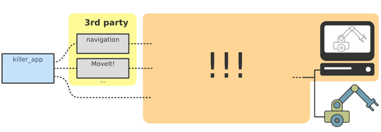

**ros_control** 就是ROS为用户提供的应用与机器人之间的**中间件**，包含一系列控制器接口、传动装置接口、硬件接口、控制器工具箱等等，可以帮助机器人应用快速落地，提高开发效率。

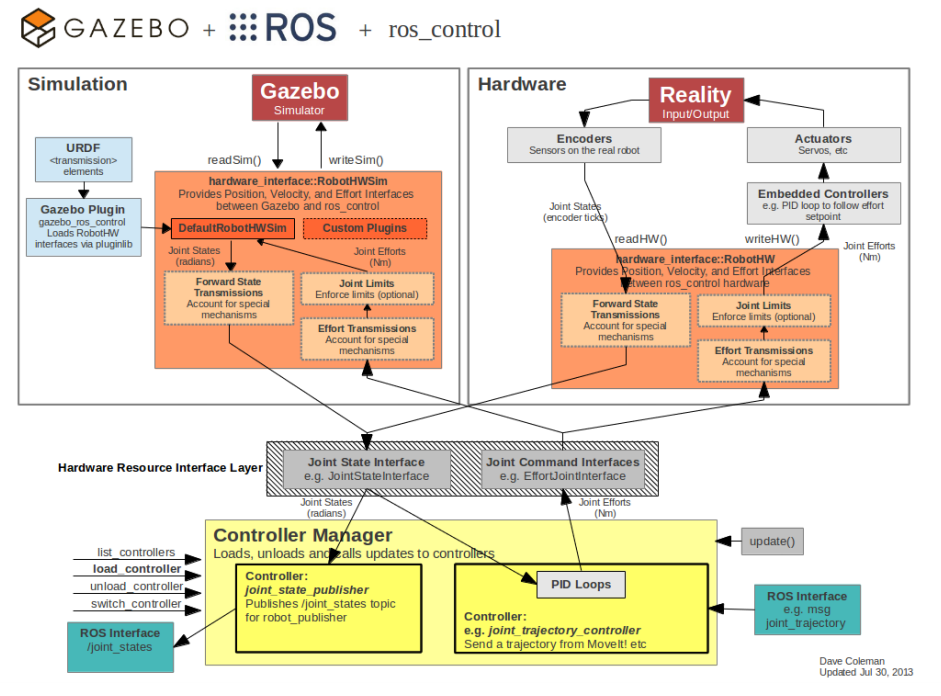

---

# 二、ros_control总体框架

## 硬件抽象层

针对不同类型的控制器（底盘、机械臂等），ros_control可以提供多种类型的控制器，但是这些控制器的接口各不相同。为了提高代码的复用率，ros_control还提供一个**硬件的抽象层**（Robot Hardware Abstraction），硬件抽象层负责机器人硬件资源的管理，而controller从抽象层请求资源即可，并不直接接触硬件。

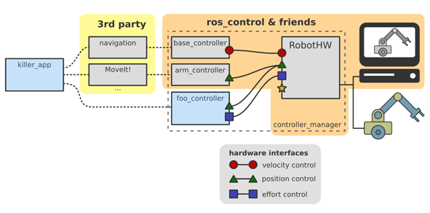
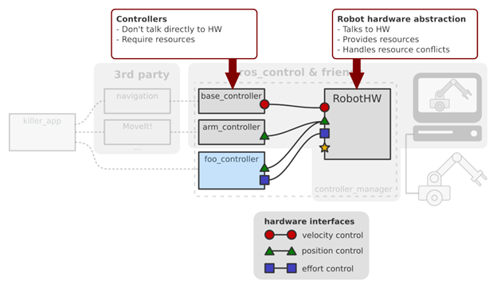

## 数据流图

ros_control的数据流可以更清晰地看到每个层次包含的功能：

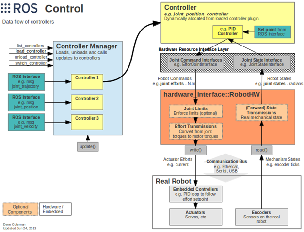

| 层次 | 功能 |
|------|------|
| **Controller Manager** | 管理器，提供通用接口管理不同controller，输入是ROS上层应用的输出 |
| **Controller** | 完成每个joint的控制，请求下层硬件资源，提供PID控制器，读取状态并发布控制命令 |
| **Hardware Resource** | 为上下两层提供硬件资源的接口 |
| **RobotHW** | 硬件抽象层，通过write和read方法操作硬件，包含关节限位、力矩转换、状态转换等 |
| **Real Robot** | 实际机器人的嵌入式控制器，接收命令后控制执行器运动 |

---

# 三、Controllers（控制器）

`ros_controllers` 功能包提供了已有的控制器：

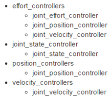

当然，也可以根据自己的需求创建自定义控制器，通过controller manager来管理：
参考：https://github.com/ros-controls/ros_control/wiki/controller_interface

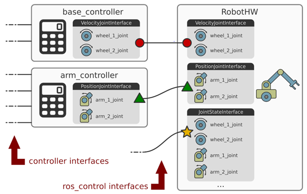

---

# 四、Hardware Interface（硬件接口）

Hardware Interface是controller和RobotHW沟通的接口，基本上和controllers的种类是对应的，同样可以自己创建需要的接口。

参考：https://github.com/ros-controls/ros_control/wiki/hardware_interface

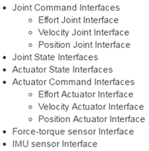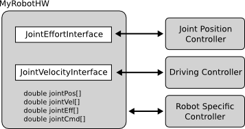

---

# 五、MoveIt与ros_control的关系

## ros_control在MoveIt中的角色

MoveIt将运动轨迹发送给机器人控制器后，**ros_control**负责机器人控制器与硬件层的交互。它是连接上层规划与底层硬件的桥梁，确保轨迹精确执行。若系统采用专有控制器，则需定制适配层，此时ros_control可能仅起中介作用。

### 1、ros_control的核心作用
- **硬件抽象与控制**：提供控制器（如位置、速度、力矩控制器）和硬件接口（如JointStateInterface、EffortInterface）的抽象层
- **实时通信**：通过硬件资源管理（RobotHW类）和控制器管理器（ControllerManager），实现与底层硬件的实时通信（如通过CAN总线、以太网等）

### 2、MoveIt与ros_control的协作流程
1. **轨迹规划**：MoveIt负责运动规划，生成关节轨迹（JointTrajectory消息）
2. **发送轨迹到控制器**：MoveIt将轨迹通过ROS Topic（如 `/joint_trajectory_controller/command`）发送给ros_control中的控制器
3. **轨迹执行**：
   - 控制器将轨迹拆解为时间步长的目标值（位置、速度等），通过PID控制生成底层指令（如电机力矩）
   - 指令通过硬件接口传递给RobotHW实现，最终由具体驱动转换为硬件信号（如PWM、CAN报文）

### 3、硬件交互的标准化与扩展
- **通用接口**：ros_control定义了 `read()` 和 `write()` 方法，硬件驱动需实现这些接口以周期性读取传感器数据和下发指令
- **实时性保障**：通过ROS实时工具链，确保控制循环的实时性（通常1kHz频率）
- **适配专有硬件**：对于专用控制器（如UR的URCaps或KUKA的KRL），可通过ros_control的适配层封装其私有协议

### 4、例外情况
- **直接硬件控制**：若机器人使用非ros_control的专用控制器（如ABB的IRC5），MoveIt可能通过其SDK直接通信，此时ros_control不参与
- **仿真与真实硬件切换**：在Gazebo等仿真器中，ros_control的 `gazebo_ros_control` 插件会替代真实硬件接口，实现无缝切换

---

# 六、MoveIt简介与学习资源

## 官方教程包moveit_tutorials
moveit_tutorials 是 MoveIt 官方提供的教程包，旨在帮助用户从零开始学习和掌握 MoveIt 的核心功能。它通过详细的代码示例、文档和演示，指导用户完成机器人运动规划的配置、编程及调试流程，是入门 MoveIt 的必备资源。

https://decyzy.github.io/moveit_tutorials/doc/getting_started/getting_started.html

## MoveIt适用于机械臂
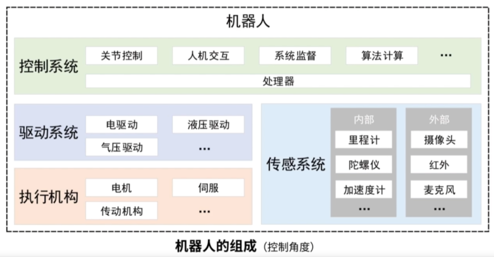
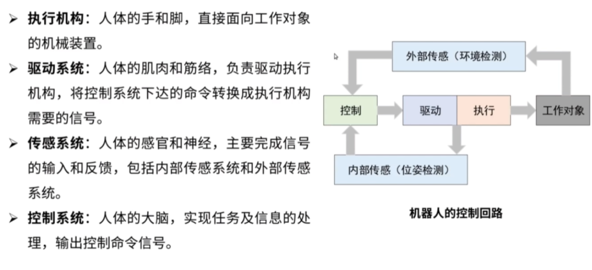
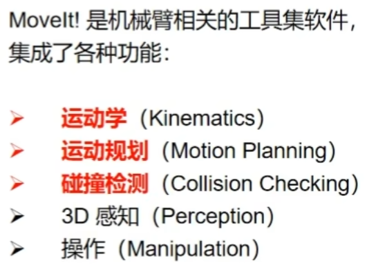

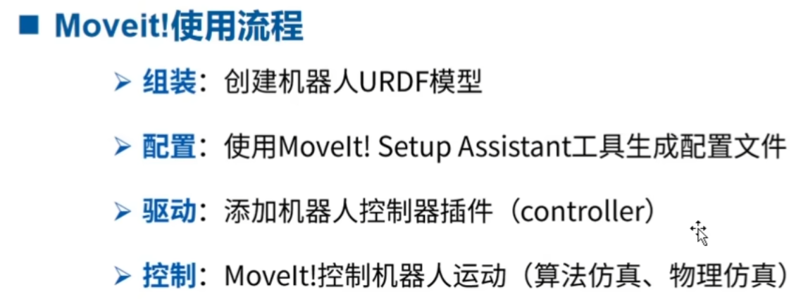
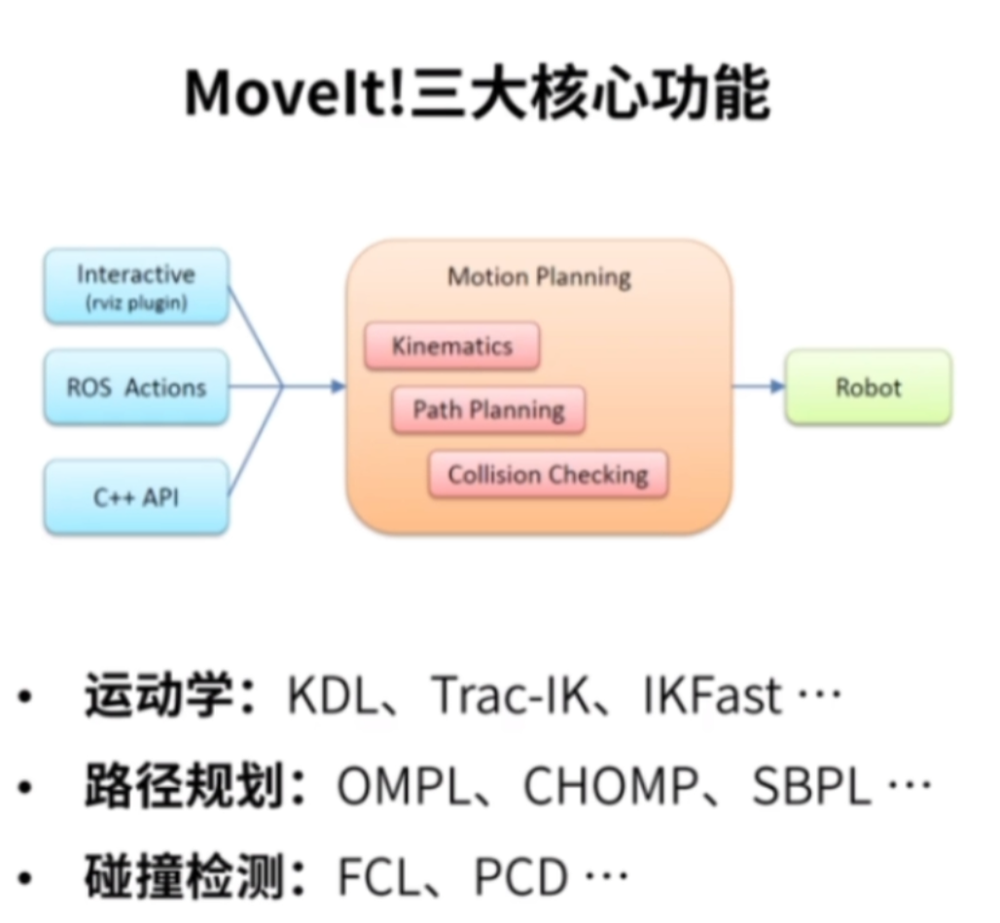
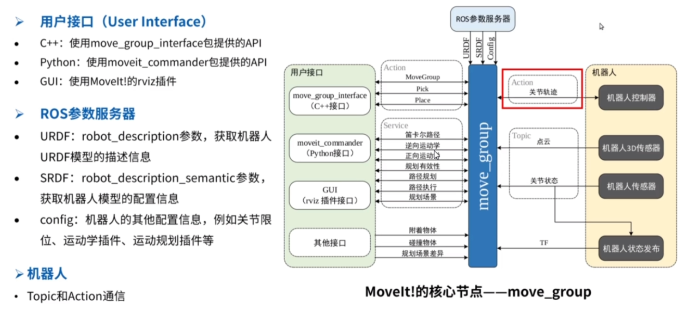

---

# 七、MoveIt通信框架

## 整体架构

MoveIt的通信分为两层Action：

### 用户与MoveIt之间的Action：MoveGroupAction

1. **角色**：用户（通过代码或RVIZ）作为Action Client，向MoveIt的move_group节点（Action Server）发送运动目标（如末端位姿、关节角度等）

2. **功能**：
   - 接收用户指定的规划目标（例如"将机械臂移动到某个位姿"）
   - 调用规划器生成轨迹，并可能直接执行轨迹（根据配置）
   - 提供反馈（如规划进度）和结果（成功/失败）

3. **Action名称**：
   - 默认路径为 `/move_group`
   - 使用的Action消息类型为 `moveit_msgs/MoveGroupAction`

### MoveIt与机器人控制器之间的Action：FollowJointTrajectoryAction

1. **角色**：MoveIt的move_group节点作为Action Client，将规划好的轨迹发送给底层控制器（如ros_control提供的控制器），控制器作为Action Server执行轨迹

2. **功能**：
   - 接收MoveIt生成的关节轨迹（JointTrajectory）
   - 实时控制机器人关节运动，确保轨迹准确执行
   - 提供反馈（如当前执行进度）和结果（执行成功/失败）

3. **Action名称**：
   - 默认路径为 `/joint_trajectory_controller/follow_joint_trajectory`（根据控制器配置可能不同）
   - 使用的Action消息类型为 `control_msgs/FollowJointTrajectory Action`

### 完整通信流程
1. **用户 → MoveIt**：用户通过MoveGroupAction发送目标（例如"抓取桌面上的物体"），MoveIt调用规划器生成轨迹并检查碰撞
2. **MoveIt → 控制器**：MoveIt通过FollowJointTrajectory Action将轨迹发送给控制器，控制器执行轨迹并实时反馈关节状态
3. **控制器 → 硬件**：控制器通过硬件接口（如ros_control）将指令发送给实际电机或仿真环境

---

# 八、MoveIt编程

## MoveIt编程的逻辑

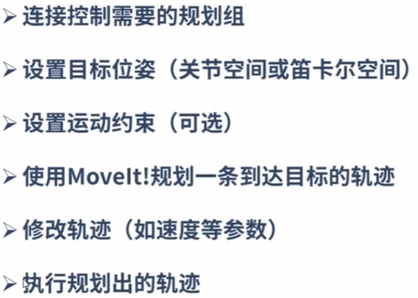
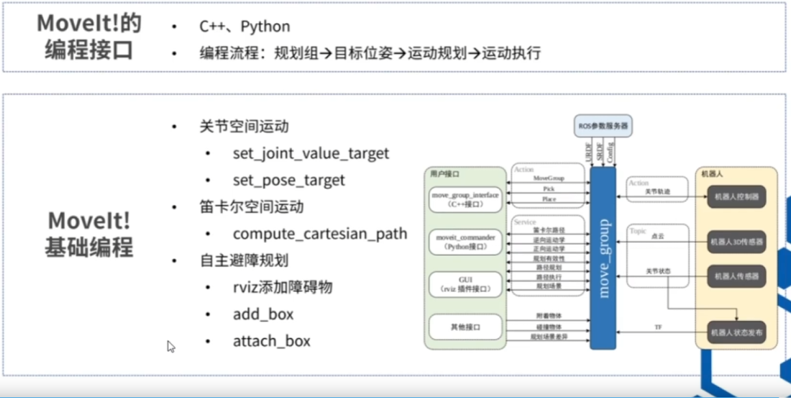

## 编程流程
1. 先运行配置好的 `demo.launch`
2. 运行自己写好的节点

> **tips：** 注意基坐标系和世界坐标系的偏移，注意不同版本的函数差异。

## 更换运动学插件

ROS默认使用KDL运动学求解器，可以更换为trac_ik或ikfast等：

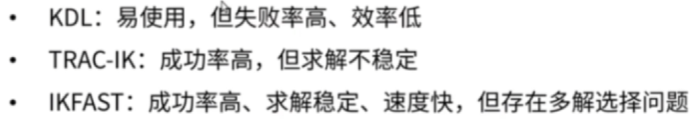

| 插件 | 类型 | 特点 |
|------|------|------|
| **KDL** | 数值解 | ROS默认，通用性强，但可能找不到解 |
| **TRAC_IK** | 数值解 | 比KDL更可靠，能找到更多解 |
| **IKFast** | 解析解 | 速度快，但需要为特定机器人编译 |

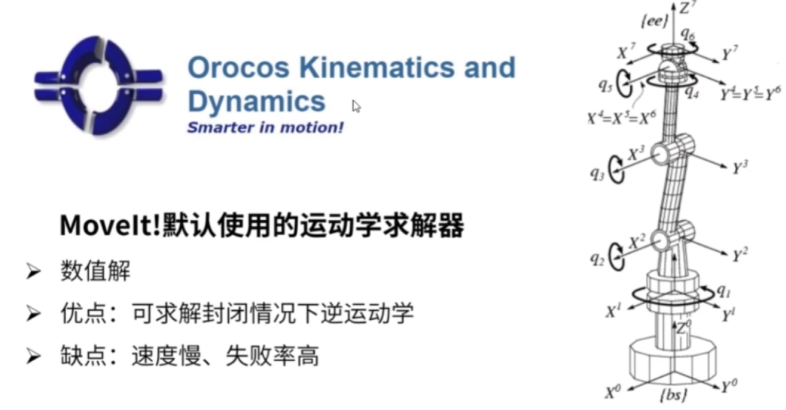
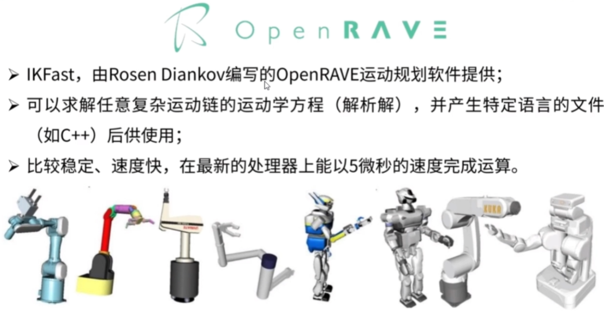

---

# 九、MoveIt规划结果的适配

## MoveIt原生轨迹的局限性

MoveIt中的plan规划的轨迹通常**不能直接发送给机器人执行**，需根据实际机械臂的控制接口和硬件特性进行适配或优化：
- MoveIt默认生成的轨迹时间戳是**非等步长**的（时间间隔从0.3秒到3秒不等），而大多数机械臂需要固定控制周期（例如1ms）的等时指令流。直接下发会导致运动不连续或执行失败
- 相邻路点的关节角度、速度、加速度变化较大，直接执行可能引发机械臂剧烈抖动或触发过载保护
- 真实机械臂通常需要特定格式的指令，而MoveIt的RobotTrajectory消息包含冗余数据，需提取并转换

## 适配方案

**1、轨迹重采样与插补**
通过算法（如三次样条）对原生轨迹进行插补，生成等时间间隔的路径点。

**2、控制器接口配置**
- Action接口适配：通过配置FollowJointTrajectory类型的action接口，将轨迹拆解为机械臂控制器可识别的关节目标序列
- PID参数调优：在控制器配置文件中设置关节的PID增益，确保轨迹跟踪的稳定性和精度

## 应用流程
1. 通过MoveIt规划生成原始轨迹，提取关节角度序列和时间戳
2. 使用插补算法或过滤器生成等时指令流
3. 通过机械臂SDK或ROS控制器接口（如ros_control）发送指令
