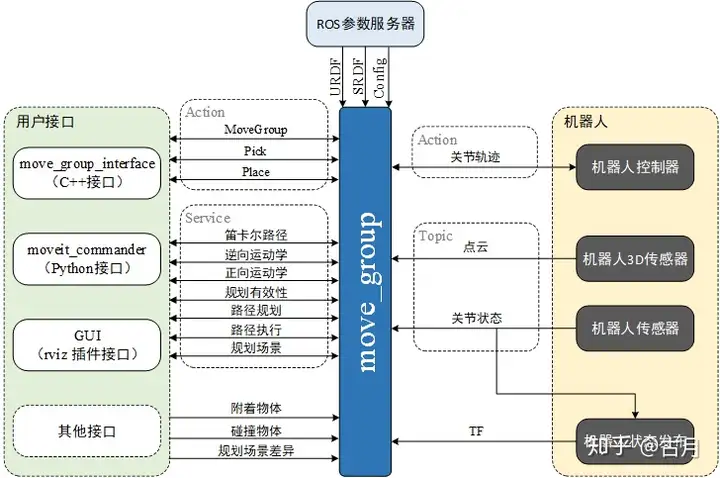
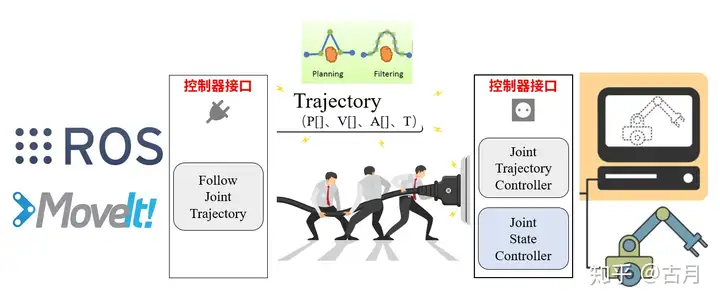
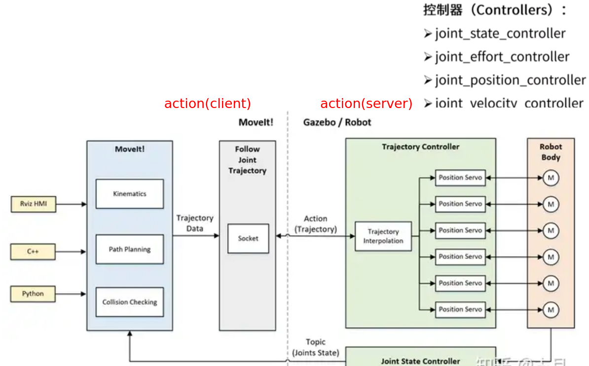
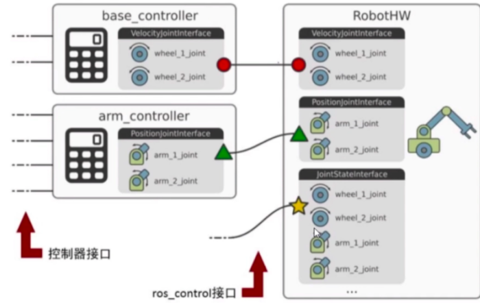
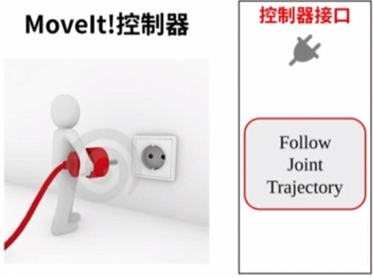
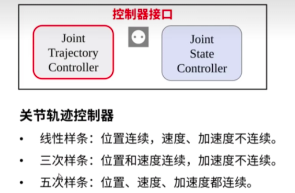
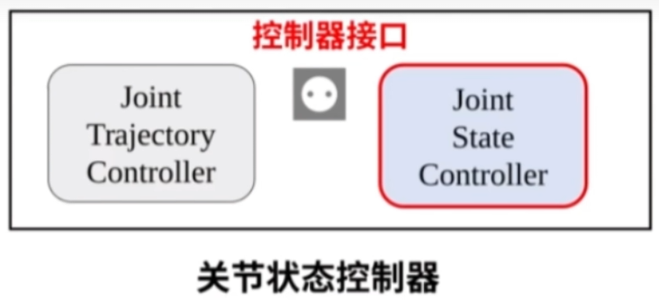
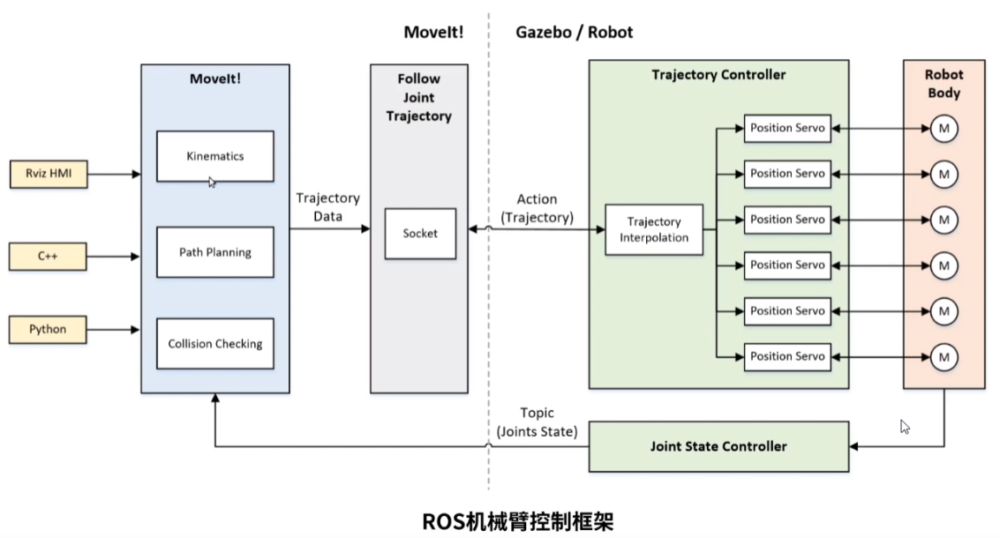

# MoveIt驱动Gazebo与真实机械臂

本章是MoveIt实战的核心内容——如何把MoveIt规划的轨迹真正发送给Gazebo仿真或真实机械臂。建议先完成前面的ros_control与MoveIt通信架构章节。

---

# 一、机器人动起来的过程

1. ROS功能包跑起来生成规划轨迹
2. 数据发给机器人控制器（中央控制器）
3. 机器人控制器完成底层控制（伺服控制）
4. 控制信号控制电机转动（功率驱动）
5. 电机实时反馈状态

**如何将ROS功能包计算得到的数据发给真实机器人并使之运动是问题的关键**

在ROS环境下，不管是移动小车的move_base，还是机械臂的MoveIt!，都是解决ROS的功能算法问题。ROS最大的好处就是：我们可以先不关注功能算法的内部实现，通过接口的拼接快速实现系统的原型。

## MoveIt!核心节点的接口

- **输入**：编程API（C++、Python）、GUI（Rviz中的Motion Planning）
- **输出**：关节轨迹（Trajectory）



先不纠结MoveIt!里边干了啥，反正当我们通过程序或者界面指定一个目标位置后，它会规划得到一条运动到目标位置的轨迹，这条轨迹由一系列关节空间的位置组成。接下来，我们要把这条轨迹发给机械臂的控制器。

---

# 二、MoveIt!控制真实机械臂的一般框架

## 1、MoveIt将轨迹发给机器人控制器的接口


## 2、逻辑框架


## 3、机器人端ros_control的逻辑


## 4、控制过程详解

1. 通过程序或界面设置机械臂运动目标（rviz/c++/python）
2. MoveIt!完成运动规划并输出关节轨迹（move_group）
3. 通过socket接口和控制器连接，将关节轨迹发送给控制器（moveit → action到机器人控制器）
4. 控制器进行插补运算，并周期发送给电机驱动器（ros_control，硬件抽象层）
5. 驱动器完成闭环控制，让电机快速、稳定地跟随输入指令
6. 控制器反馈实时状态到MoveIt!，Rviz动态显示当前状态（joint state）

---

# 三、控制器接口配置

在MoveIt生成的config文件中配置yaml和launch文件：

```
配置注意事项：
    launch文件中节点的关键配置在于 args 参数，需与 YAML 文件中的控制器名称严格匹配。
    例如，若 YAML 中定义了 joint_state_controller 和 arm_position_controller，则 args 应包含这些名称。
    若节点自定义名称与其他节点重复（如 controller_spawner），可能导致 ROS 节点管理器报错。
    建议通过 rosnode list 命令检查运行时的节点名称唯一性。
```

## 1、FollowJointTrajectory（MoveIt端）

这是MoveIt侧的控制器配置，告诉MoveIt如何将轨迹发送给机器人控制器。



### 参数配置（yaml）
```yaml
controller_list:  # 控制器列表
  - name: manipulator_controller  # 控制器名称
    type: FollowJointTrajectory # 控制器类型
    joints: # 关节列表
      - joint1
      - joint2
      - joint3
      - joint4
      - joint5
      - joint6
      - joint7    
```

### 控制器启动（launch）
```xml
<launch>
  <!-- 指定使用 MoveIt 内置的简单控制器管理器 -->
  <arg name="moveit_controller_manager" default="moveit_simple_controller_manager/MoveItSimpleControllerManager"/>
  <param name="moveit_controller_manager" value="$(arg moveit_controller_manager)" />
  
  <!-- 明确 MoveIt 需要控制的关节组及其对应的 ROS action 接口 -->
  <rosparam file="$(find manipulator_moveit_config)/config/xxxxxxx.yaml" />
  <!-- 配置底层控制器参数 -->
  <rosparam file="$(find manipulator_moveit_config)/config/xxxxxxx.yaml" />
</launch>
```

---

## 2、JointTrajectoryController（Gazebo/机器人端）

这是Gazebo或真实机器人侧的控制器配置，用于接收轨迹并完成每个关节的插补。



### 参数配置（yaml）
```yaml
my_robot_name:  # 机器人名称
  manipulator_controller:  # 机器人控制器配置
    type: position_controllers/JointTrajectoryController  # 控制器类型
    joints:  # 关节列表
      - joint1
      - joint2
      - joint3
      - joint4
      - joint5
      - joint6
      - joint7
    gains: # 控制器参数（PID）
      joint1:
        p: 1000.0
        i: 0.0
        d: 0.0
        i_clamp: 0.0
      # 其他关节参数...
```

### 控制器启动（launch）
```xml
<?xml version="1.0"?>
<launch>
  <!-- 加载控制器配置到参数服务器 -->
  <rosparam file="$(find manipulator_moveit_config)/config/xxxxxx.yaml" command="load"/>

  <!-- 启动控制器，节点名称可自定义 -->
  <node name="controller_spawner" pkg="controller_manager" type="spawner" respawn="false"
    output="screen" args="manipulator_controller"/>
</launch>
```

---

## 3、JointStateController（Gazebo/机器人端）

用于发布关节状态信息，让RViz能实时显示机器人姿态。



### 参数配置（yaml）
```yaml
my_robot_name:
  joint_state_controller:
    type: joint_state_controller/JointStateController
    publish_rate: 50  # 发布频率50Hz
```

### 控制器启动（launch）
```xml
<launch>
  <!-- 加载控制器配置 -->
  <rosparam file="$(find manipulator_moveit_config)/config/xxxxxx.yaml" command="load"/>
  <!-- 启动关节状态控制器 -->
  <node name="gazebo_controller_spawner" pkg="controller_manager" type="spawner" 
    respawn="false" output="screen" args="joint_state_controller"/>
  <!-- 发布TF变换 -->
  <node name="robot_state_publisher" pkg="robot_state_publisher" type="robot_state_publisher" 
    respawn="true" output="screen"/>
</launch>
```

---

# 四、完整实践：MoveIt + Gazebo仿真实战

## 启动顺序

1. 首先启动Gazebo（用一个launch）
2. 启动JointStateController的launch
3. 启动JointTrajectoryController的launch
4. 启动FollowJointTrajectory的launch
5. 启动相应的move_group和rviz

## 完整配置文件示例

### myRobot_controllers.yaml
```yaml
# 机器人控制器配置
manipulator_controller:
  type: position_controllers/JointTrajectoryController
  joints:
    - joint1
    - joint2
    - joint3
    - joint4
    - joint5
    - joint6
    - joint7
  gains:
    joint1: {p: 1000, d: 1, i: 1, i_clamp: 1}
    joint2: {p: 1000, d: 1, i: 1, i_clamp: 1}
    joint3: {p: 1000, d: 1, i: 1, i_clamp: 1}
    joint4: {p: 1000, d: 1, i: 1, i_clamp: 1}
    joint5: {p: 1000, d: 1, i: 1, i_clamp: 1}
    joint6: {p: 1000, d: 1, i: 1, i_clamp: 1}
    joint7: {p: 1000, d: 1, i: 1, i_clamp: 1}

# 关节状态控制器
joint_state_controller:
  type: joint_state_controller/JointStateController
  publish_rate: 50

# MoveIt控制器列表
controller_list:
  - name: manipulator_controller
    action_ns: follow_joint_trajectory
    type: FollowJointTrajectory
    default: True
    joints:
      - joint1
      - joint2
      - joint3
      - joint4
      - joint5
      - joint6
      - joint7
```

### myRobot_controllers.launch
```xml
<launch>
  <!-- ==================== Gazebo启动 ==================== -->
  <arg name="gazebo_gui" default="true"/>
  <arg name="paused" default="false"/>
  <arg name="world_name" default="worlds/empty.world"/>
  <arg name="world_pose" default="-x 0 -y 0 -z 0 -R 0 -P 0 -Y 0"/>
  <arg name="initial_joint_positions" default="-J joint1 0 -J joint2 0 -J joint3 0 -J joint4 0 -J joint5 0 -J joint6 0 -J joint7 0"/>

  <!-- 启动Gazebo（暂停状态，等待控制器就绪） -->
  <include file="$(find gazebo_ros)/launch/empty_world.launch" pass_all_args="true">
    <arg name="paused" value="true"/>
  </include>

  <!-- 加载URDF到参数服务器 -->
  <param name="robot_description" textfile="$(find manipulator)/urdf/manipulator.urdf"/>

  <!-- 在Gazebo中生成机器人模型 -->
  <arg name="unpause" value="$(eval '' if arg('paused') else '-unpause')"/>
  <node name="spawn_gazebo_model" pkg="gazebo_ros" type="spawn_model" 
    args="-urdf -param robot_description -model robot $(arg unpause) $(arg world_pose) $(arg initial_joint_positions)" 
    respawn="false" output="screen"/>

  <!-- ==================== 控制器配置 ==================== -->
  <rosparam file="$(find manipulator_moveit_config)/config/myRobot_controllers.yaml" command="load"/>
  
  <!-- 启动轨迹控制器 -->
  <node name="controller_spawner" pkg="controller_manager" type="spawner" 
    respawn="false" output="screen" args="manipulator_controller"/>
  
  <!-- 启动关节状态控制器 -->
  <node name="gazebo_controller_spawner" pkg="controller_manager" type="spawner" 
    respawn="false" output="screen" args="joint_state_controller"/>
  
  <!-- 发布TF变换 -->
  <node name="robot_state_publisher" pkg="robot_state_publisher" type="robot_state_publisher" 
    respawn="true" output="screen"/>

  <!-- 配置MoveIt控制器管理器 -->
  <param name="moveit_controller_manager" value="moveit_simple_controller_manager/MoveItSimpleControllerManager"/>

  <!-- ==================== MoveIt启动 ==================== -->
  <arg name="pipeline" default="ompl"/>
  <arg name="load_robot_description" default="true"/>
  <arg name="moveit_controller_manager" default="ros_control"/>

  <!-- 启动move_group -->
  <include file="$(dirname)/move_group.launch">
    <arg name="allow_trajectory_execution" value="true"/>
    <arg name="moveit_controller_manager" value="$(arg moveit_controller_manager)"/>
    <arg name="info" value="true"/>
    <arg name="pipeline" value="$(arg pipeline)"/>
    <arg name="load_robot_description" value="$(arg load_robot_description)"/>
  </include>

  <!-- 启动RViz可视化 -->
  <include file="$(dirname)/moveit_rviz.launch">
    <arg name="rviz_config" value="$(dirname)/moveit.rviz"/>
  </include>
</launch>
```

---

# 五、控制系统设计方法



（此部分为控制系统设计的参考图示，具体设计方法请根据实际项目需求参考相关资料。）
