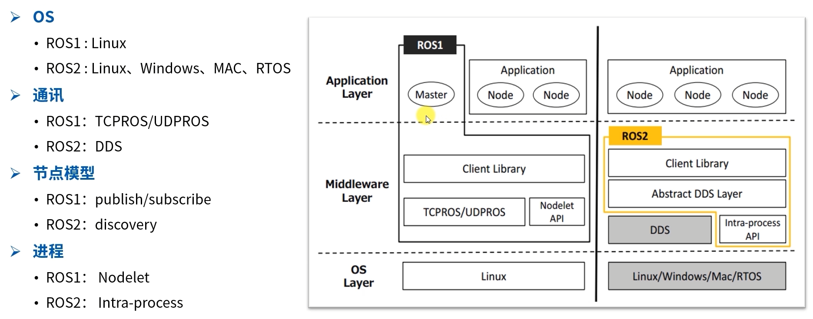

# ROS2与ROS1详细对比

本章从架构、通信、工具链、编程等维度全面对比ROS1和ROS2，帮助有ROS1基础的开发者快速理解差异。

---

# 一、架构设计对比

| 对比项 | ROS1 | ROS2 |
|--------|------|------|
| 节点发现 | 依赖ROS Master（单点故障） | 基于DDS自动发现（去中心化） |
| 通信协议 | 自定义TCP/UDP | DDS（工业级标准） |
| 实时性 | 不支持 | 支持实时控制（可选实时内核） |
| 安全性 | 无内置安全机制 | DDS-Security（认证/加密/访问控制） |
| 跨平台 | 仅Linux | Linux / Windows / macOS |
| 多机器人 | 困难，需手动隔离 | 原生支持命名空间和域ID隔离 |
| 进程模型 | 单进程多节点（Nodelet） | 组件（Component）+ 独立进程 |



---

# 二、通信机制对比

## 2.1 话题（Topic）

| 对比项 | ROS1 | ROS2 |
|--------|------|------|
| 底层协议 | 自定义TCP/UDP | DDS |
| QoS策略 | 无 | 支持（可靠性、持久性、历史深度等） |
| 消息定义 | `.msg`文件 | `.msg`文件（语法相同） |
| 接口包 | `std_msgs`、`geometry_msgs`等 | 同名包，接口兼容 |

### QoS（Quality of Service）策略

ROS2引入了QoS策略，让你可以精细控制通信行为：

```python
from rclpy.qos import QoSProfile, ReliabilityPolicy, DurabilityPolicy

# 示例：传感器数据用"尽力而为"模式（低延迟，允许丢帧）
qos = QoSProfile(
    depth=10,
    reliability=ReliabilityPolicy.BEST_EFFORT,
    durability=DurabilityPolicy.VOLATILE
)
publisher = self.create_publisher(Twist, '/cmd_vel', qos)
```

**常用QoS策略：**
| 策略 | 选项 | 说明 |
|------|------|------|
| Reliability | RELIABLE / BEST_EFFORT | 可靠传输 vs 尽力而为 |
| Durability | TRANSIENT_LOCAL / VOLATILE | 保留最后消息 vs 不保留 |
| History | KEEP_LAST / KEEP_ALL | 保留最近N条 vs 全部保留 |

## 2.2 服务（Service）

| 对比项 | ROS1 | ROS2 |
|--------|------|------|
| 协议 | 自定义TCP | DDS RPC |
| 接口定义 | `.srv`文件 | `.srv`文件（语法相同） |
| 同步调用 | `rospy.ServiceProxy` | `client.call()` / `client.call_async()` |

## 2.3 动作（Action）

| 对比项 | ROS1 | ROS2 |
|------|------|------|
| 实现 | `actionlib`（第三方） | 内置支持 |
| 接口定义 | `.action`文件 | `.action`文件（语法相同） |
| API | `SimpleActionClient` | `ActionClient` |

## 2.4 参数（Parameter）

| 对比项 | ROS1 | ROS2 |
|------|------|------|
| 存储位置 | ROS Master（全局） | 每个节点独立管理 |
| 类型支持 | 基本类型 | 基本类型 + 嵌套结构 |
| 生命周期 | Master重启后丢失 | 节点生命周期内持久 |

---

# 三、编译系统对比

| 对比项 | ROS1 | ROS2 |
|--------|------|------|
| 编译工具 | catkin（基于CMake） | ament（基于CMake） + colcon |
| 编译命令 | `catkin_make` | `colcon build` |
| 工作空间 | `catkin_ws` | `ros2_ws` |
| 编译结果 | `devel/` | `install/` |
| Python包 | 需要CMakeLists.txt | 只需`setup.py` |
| 包描述 | `package.xml`（格式2） | `package.xml`（格式3） |

### colcon常用命令

```bash
# 编译整个工作空间
colcon build

# 编译指定包
colcon build --packages-select my_pkg

# 编译并设置环境变量
colcon build --symlink-install

# 运行测试
colcon test

# 查看编译日志
colcon test-result --verbose
```

---

# 四、编程API对比

## 4.1 Python节点对比

**ROS1（rospy）：**
```python
#!/usr/bin/env python
import rospy
from std_msgs.msg import String

def callback(msg):
    rospy.loginfo("Received: %s", msg.data)

rospy.init_node('listener')
sub = rospy.Subscriber('chatter', String, callback)
rospy.spin()
```

**ROS2（rclpy）：**
```python
#!/usr/bin/env python3
import rclpy
from rclpy.node import Node
from std_msgs.msg import String

class Listener(Node):
    def __init__(self):
        super().__init__('listener')
        self.sub = self.create_subscription(String, 'chatter', self.callback, 10)

    def callback(self, msg):
        self.get_logger().info(f'Received: {msg.data}')

rclpy.init()
node = Listener()
rclpy.spin(node)
rclpy.shutdown()
```

**关键差异：**
| 对比项 | ROS1 (rospy) | ROS2 (rclpy) |
|--------|-------------|-------------|
| 节点定义 | `rospy.init_node()` | 类继承 `Node` |
| 日志 | `rospy.loginfo()` | `self.get_logger().info()` |
| 订阅队列 | 无（默认无限） | 必须指定队列大小 |
| 启动方式 | 直接运行 | `rclpy.init()` + `rclpy.spin()` |

## 4.2 C++节点对比

**ROS1（roscpp）：**
```cpp
#include <ros/ros.h>
#include <std_msgs/String.h>

void callback(const std_msgs::String::ConstPtr& msg) {
    ROS_INFO("Received: %s", msg->data.c_str());
}

int main(int argc, char** argv) {
    ros::init(argc, argv, "listener");
    ros::NodeHandle nh;
    ros::Subscriber sub = nh.subscribe("chatter", 10, callback);
    ros::spin();
}
```

**ROS2（rclcpp）：**
```cpp
#include <rclcpp/rclcpp.hpp>
#include <std_msgs/msg/string.hpp>

class Listener : public rclcpp::Node {
public:
    Listener() : Node("listener") {
        sub_ = create_subscription<std_msgs::msg::String>(
            "chatter", 10,
            [this](const std_msgs::msg::String::msg::SharedPtr msg) {
                RCLCPP_INFO(get_logger(), "Received: %s", msg->data.c_str());
            });
    }
private:
    rclcpp::Subscription<std_msgs::msg::String>::SharedPtr sub_;
};

int main(int argc, char** argv) {
    rclcpp::init(argc, argv);
    rclcpp::spin(std::make_shared<Listener>());
    rclcpp::shutdown();
}
```

---

# 五、Launch文件对比

## ROS1 Launch（XML）
```xml
<launch>
  <node pkg="turtlesim" type="turtlesim_node" name="my_turtle"/>
  <node pkg="turtlesim" type="turtle_teleop_key" name="teleop"/>
</launch>
```

## ROS2 Launch（Python）
```python
from launch import LaunchDescription
from launch_ros.actions import Node

def generate_launch_description():
    return LaunchDescription([
        Node(
            package='turtlesim',
            executable='turtlesim_node',
            name='my_turtle'
        ),
        Node(
            package='turtlesim',
            executable='turtle_teleop_key',
            name='teleop'
        ),
    ])
```

> ROS2也支持YAML和XML格式的launch，但**Python格式最灵活**，推荐使用。

---

# 六、工具链对比

| 工具 | ROS1 | ROS2 |
|------|------|------|
| 命令行 | `rosrun`、`roslaunch` | `ros2 run`、`ros2 launch` |
| 话题查看 | `rostopic list/echo` | `ros2 topic list/echo` |
| 节点查看 | `rosnode list/info` | `ros2 node list/info` |
| 参数 | `rosparam` | `ros2 param` |
| 可视化 | RViz | RViz2 |
| TF | tf | tf2 |
| 仿真 | Gazebo Classic | Gazebo (Ignition) / Gazebo Classic |
| 包管理 | `rosdep` | `rosdep`（相同） |

---

# 七、从ROS1迁移到ROS2的关键点

1. **代码结构**：从脚本式改为面向对象（类继承Node）
2. **QoS配置**：根据数据类型选择合适的QoS策略
3. **Launch文件**：从XML迁移到Python
4. **编译工具**：从catkin迁移到colcon
5. **接口兼容**：`.msg`、`.srv`、`.action`文件格式基本相同
6. **命名空间**：利用ROS2的命名空间特性实现多机器人

**迁移建议：**
- 新项目直接用ROS2
- 老项目可以用 `ros1_bridge` 做过渡
- MoveIt用户迁移到MoveIt2
