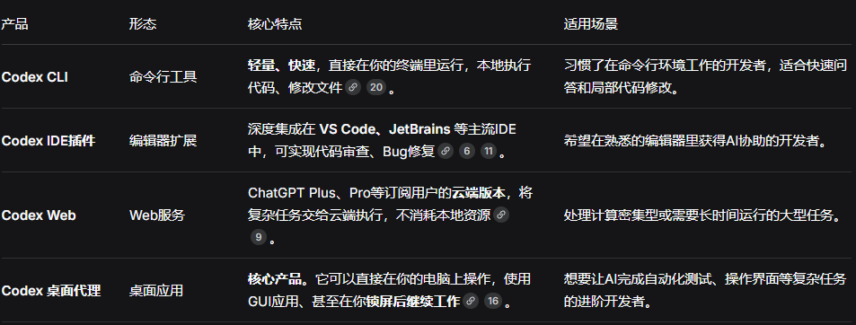

# AI 编程工具

## 1. Cursor

基于 VS Code 魔改的 **AI 原生编辑器**，AI 深度内置而非插件形式，集成 GPT-4、Claude 3.5 等大模型。

> 想用自己的 API Key → 必须开 Cursor Pro；免费版只能用 Cursor 自带模型。

### VS Code + Copilot 对比

| 对比项 | Cursor | VS Code + Copilot |
|--------|--------|-------------------|
| 集成深度 | 底层集成 | 插件形式，上下文有限 |
| 多文件编辑 | 原生支持 | 需手动切换文件 |
| 自然语言交互 | 全流程支持 | 仅补全，聊天需切页面 |
| 上手难度 | 更低，适合新手 | 需熟悉插件生态 |

---

## 2. GitHub Copilot

GitHub 与 OpenAI 联合推出的 AI 编程助手，能在写代码时实时提供建议、补全代码、生成函数 / 测试 / 注释的 **"智能结对程序员"**。

定位：IDE 插件 + 云端大模型（GPT-4o / Codex 等）。

> 在 VS Code 等编辑器里敲代码 → 插件把上下文（当前文件、附近代码、注释）发送给 GitHub 云端 → 云端用 LLM 分析，返回最可能的代码片段 → 灰色提示显示，按 Tab 即可接受。现在支持多模型切换：GPT-4o、Claude、Gemini 等。

---

## 3. CC Switch

跨平台桌面工具，统一管理多款 AI 编程 CLI 工具与 API 供应商配置，实现**一键切换与集中管理**。

> Claude Code → CC Switch，早期主打管理 Claude Code，后来扩展到多款 AI 编程工具。

**适用工具：** Claude Code、OpenAI Codex CLI、Google Gemini CLI、OpenCode、OpenClaw

**主要解决痛点：**
- 各工具配置格式不统一（JSON / TOML / .env）
- 切换 API 供应商需手动改配置文件
- MCP、Skills、提示词无法统一管理
- 配置易丢失、损坏

---

## 4. Claude Code

Anthropic 推出的**终端原生、能自主干活的 AI 编程智能体（Agent）**—— 跑在终端里的 **"AI 程序员"**，能直接读代码、改文件、跑命令、修 Bug、管理 Git，而非仅补全代码。

> Claude 有自己的大模型，但订阅和买 API Key 都需要注册账号，国内使用受限且容易被封号。

**推荐使用方式：**
 Claude Code + CC Switch + DeepSeek API/mimo API/其他api
 全局安装后建议在命令行中使用，在vscode可以装个插件

> 配合 Cursor 使用更佳，可同时享受 Cursor 的自动补全和 Claude Code 的复杂任务处理能力。

### Cursor 与 Claude Code 的关系

| 工具 | 定位 | 适用场景 |
|------|------|----------|
| **Cursor** | 带 AI Agent 的 IDE（VS Code 加强版 + 内置 AI） | 日常编码，更顺手、更高效、更省钱 |
| **Claude Code** | Anthropic 官方独立终端 Agent 工具 | 全自动干活（读库、多文件修改、跑命令、Git、测试、部署） |

- Cursor 内置两套核心：自研 Composer + 第三方 Claude / GPT 等，默认用 Claude 与自家 Composer。Cursor 里的 Claude 是在 Cursor 编辑器中调用 Anthropic 的 Claude 模型来聊天、补代码、做简单修改。
- Claude Code 是 Anthropic 官方出品的独立终端 Agent 工具，专门用来全自动干活。
- 两者互补，可单独使用也可协同工作。日常编码用 Cursor 更顺手；大任务再用 Claude Code。

**在wsl下启动claude，需要使用命令claude.exe**

---

## 5. Codex

全称 **OpenAI Codex Agent**，定位为云端 + 本地桌面的 **"AI 软件工程师"**，功能与 Claude Code 类似。

> Codex 使用最好订阅 ChatGPT 或购买 GPT 的 API Key，比较稳定，不容易被封号。Codex 默认使用 OpenAI 的 Responses API，而 DeepSeek 官方目前主要支持 Chat / Completions API，两者协议不互通，需通过本地代理做协议转换。

**Codex 使用方式比较多样：**

> 最好是在桌面app中，功能比较全

