# CAN通信基础
## 1、CAN定义
### 概念
CAN是控制器局域网络(Controller Area Network)的简称，1986年被德国研发和生产汽车电子产品著称的BOSCH公司所开发，并最终成为国际标准（ISO11898），是国际上应用最广泛的现场总线之一。 在北美和西欧，CAN总线协议已经成为汽车计算机控制系统和嵌入式工业控制局域网的标准总线。
CAN是国际标准化的串行通信协议，采用数据块编码的方式，数据块根据帧的类型，能够让挂载在总线上的不同节点接收到相同的数据，再根据每个节点的配置对信息进行选择性处理（接收or丢弃）。

控制器局域网controller area network，异步通讯，有can高和can低两条信号线，构成一组差分信号线；
差分信号抗干扰能力强，当外界存在噪声干扰时，几乎会同时耦合到两条信号线上，而接收端只关心两个信号的差值，所以外界的共模噪声可以被完全抵消。

### 硬件连接
CAN总线可以开环也可以闭环
CAN 通讯节点由一个 CAN 控制器及 CAN 收发器组成，控制器与收发器之间通过 CAN_Tx 及CAN_Rx 信号线相连，收发器与 CAN 总线之间使用 CAN_High 及 CAN_Low 信号线相连。其中CAN_Tx 及 CAN_Rx 使用普通的类似 TTL 逻辑信号，而 CAN_High 及 CAN_Low 是一对差分信号线，使用比较特别的差分信号。


网络的两端必须有120Ω的终端电阻。所以在设计线路板的时候都要有一个120欧的电阻。通过跳线或者拨码开关选择是否使用这个电阻。为什么是120Ω，因为电缆的特性阻抗为120Ω，为了模拟无限远的传输线，平衡信号完整性、抗干扰能力和功耗。

### 差分信号


CAN 通讯是半双工的，收发数据需要分时进行。
在 CAN 的通讯网络中，因为共用总线，在整个网络中同一时刻只能有一个通讯节点发送信号，其余的节点在该时刻都只能接收。
当 CAN 节点需要发送数据时，控制器把要发送的二进制编码通过 CAN_Tx 线发送到收发器，然后由收发器把这个普通的逻辑电平信号转化成差分信号，通过差分线 CAN_High 和 CAN_Low 线输出到 CAN 总线网络。而通过收发器接收总线上的数据到控制器时，则是相反的过程，收发器把总线上收到的 CAN_High 及 CAN_Low 信号转化成普通的逻辑电平信号，通过 CAN_Rx 输出到控制器中。


## 2、CAN数据帧
**波特率**:CAN总线的波特率是指单位时间内传输的二进制位数（bit/s），直接决定了数据传输速度和通信效率。在CAN总线中，由于物理层仅使用显性0和隐性1两种状态（即二进制码元），波特率与比特率在数值上相等，因此常被混用。
```
二进制码元，一个bit就能表示一个2进制（0，1），所以比特率== 比特率
四进制码元，两个bit表示一个4进制（0，1，2，3），所以比特率== 2*波特率
```
 每一个节点都可以主动发送帧。(帧是CAN协议规定的发送或接收的单位) 。帧由段组成，段由二进制位组成。
 
帧的种类有很多，其中错误帧、过载帧、帧间隔都是由硬件完成的，没有办法用软件来控制。对于一般使用者来说，只需要掌握数据帧与遥控帧。数据帧和遥控帧有标准格式与扩展格式。标准格式有11位标识符，扩展格式有29位标识符。
数据帧和遥控帧结构上差不多，最大的区别就是遥控帧没有数据段。 数据帧也是最复杂的帧。


## 3、CAN通信过程
每个节点都有个自己专用的过滤器


# CANopen通信基础
## 1、CAN和canopen的关系
**Can的OSI模型**

*CAN现场总线本身仅仅实现了物理层和数据链路层，CANopen是CAN现场总线的应用层协议。*

**CIA组织**

**CANopen常见规范**

## 2、canopen概述

```
canopen采用小端模式，表示的是字节序，16进制显示，下图实际表示 40 6063 00 00 00 00 00
```

### (1)Object Dictionary(OD对象字典)
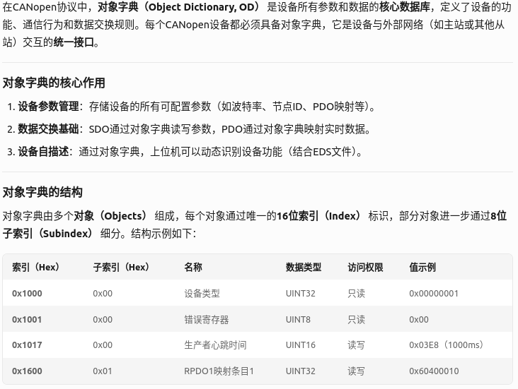

*对象字典的索引位置在*

例如：


### (2)通讯标识符


**总位数11位，采用11位标准帧，和canID一致，也可以扩展至29位，11位为4+7，使用16进制表示为0x000，例如0x601，而其二进制为0110 00000001**
### (3)canopen数据帧

DLC是发送报文时必须设置的字段，其值需严格等于数据域的实际字节数。正确配置DLC是保障CANopen通信可靠性的基础，尤其在实时性要求高的PDO传输和分段SDO操作中。can-utils的cansend工具会根据用户输入的数据十六进制字符数量自动计算DLC。

### (4)CANopen状态机
设备上电之后进入初始化状态；
初始化结束之后自动进入预操作状态；
**六种不同的报文服务**
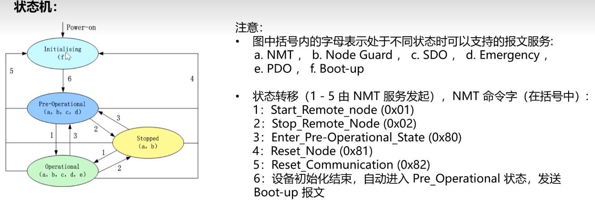
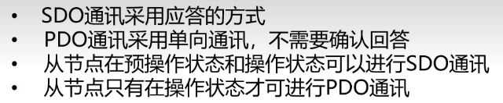
### (5)CANopen状态管理报文
#### a、NMT模块控制报文
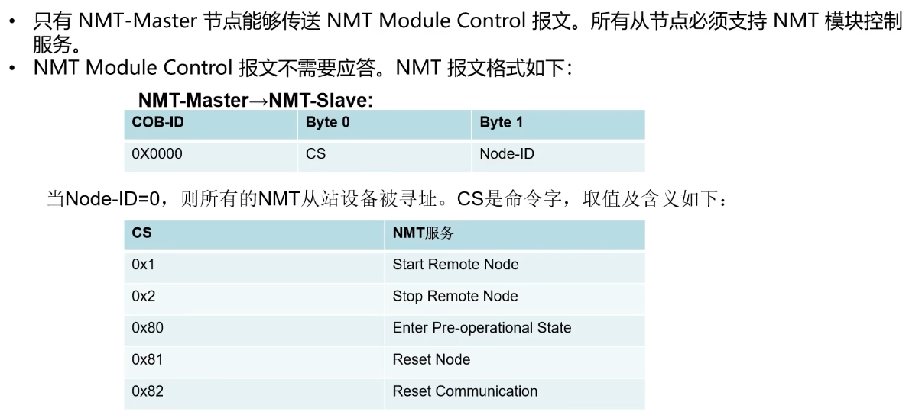
#### b、NMT节点保护报文
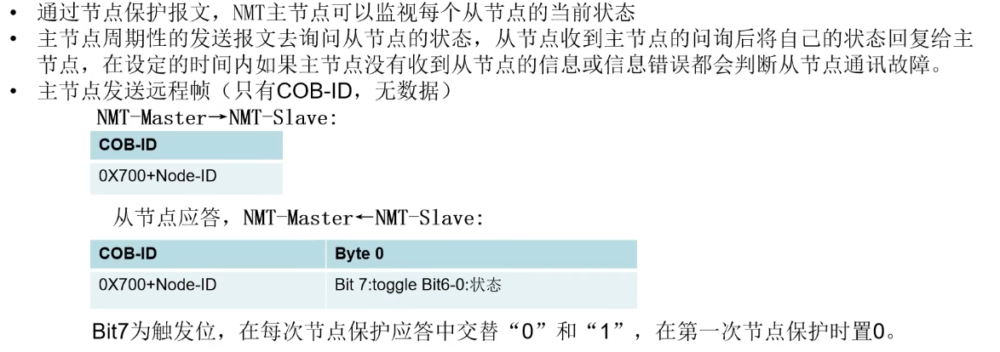
#### c、心跳报文
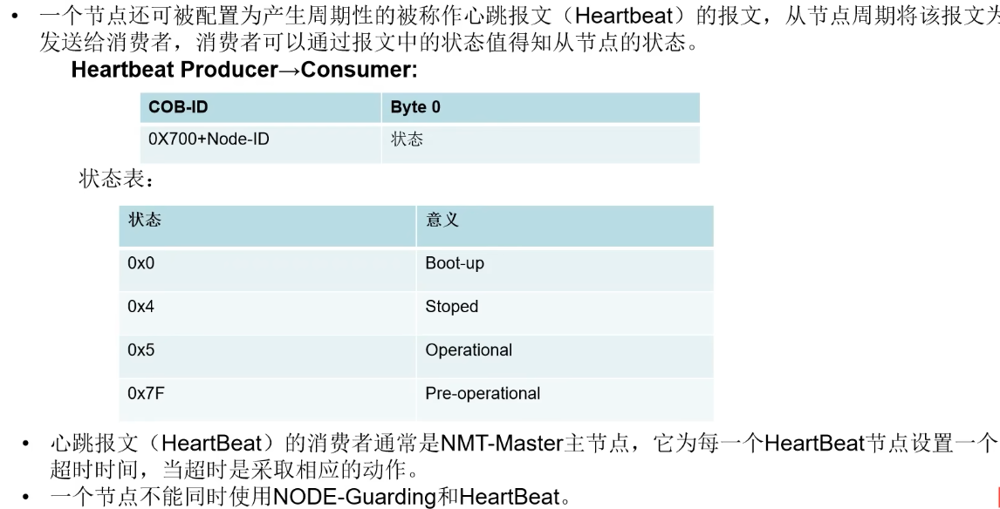
#### d、NMT BOOT-UP启动报文
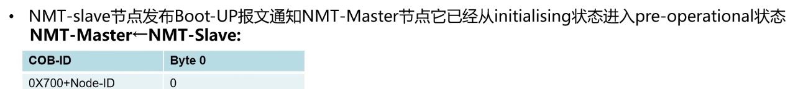
#### e、紧急报文
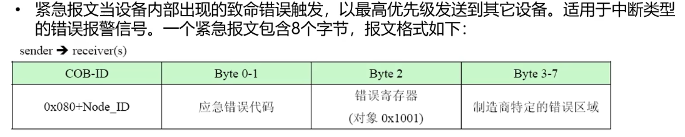

### (6)SDO通讯
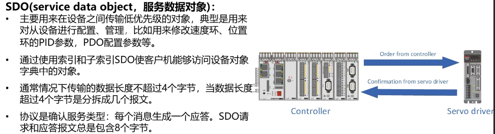
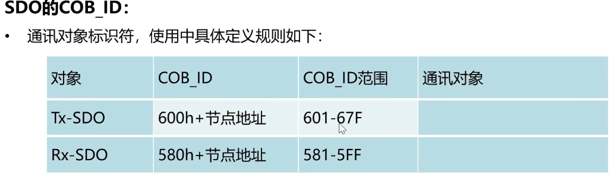
#### SDO读报文(读从站数据)
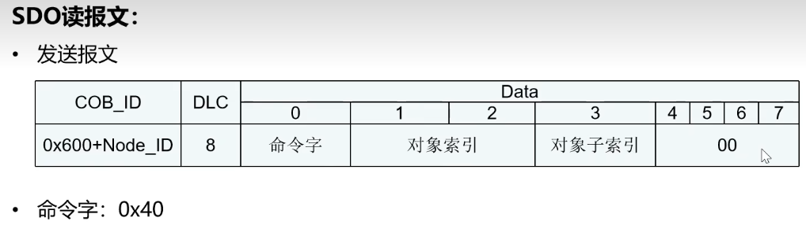
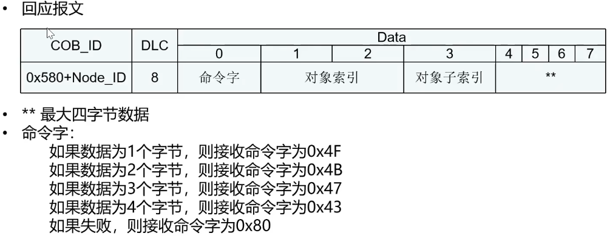
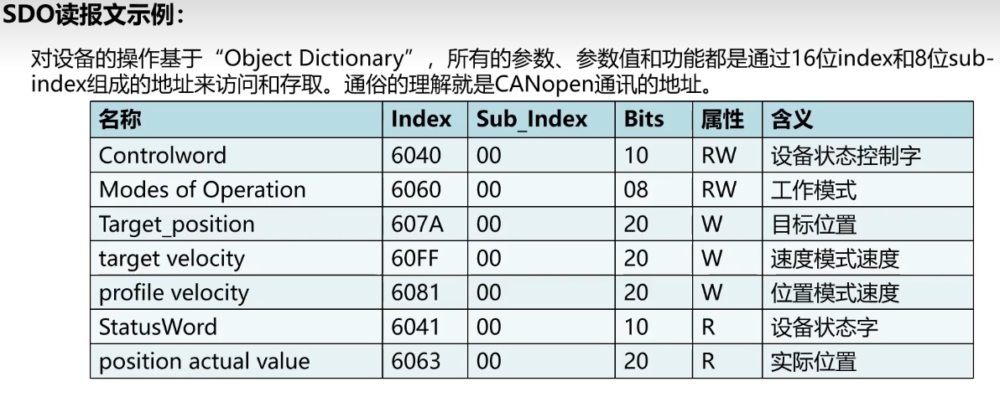
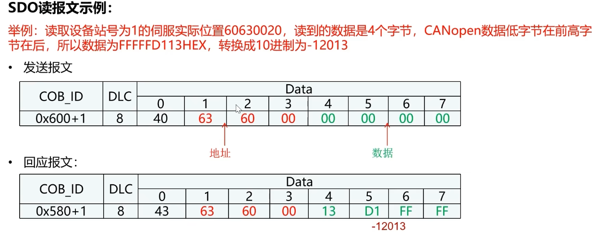
#### SDO写报文(往从站写数据)
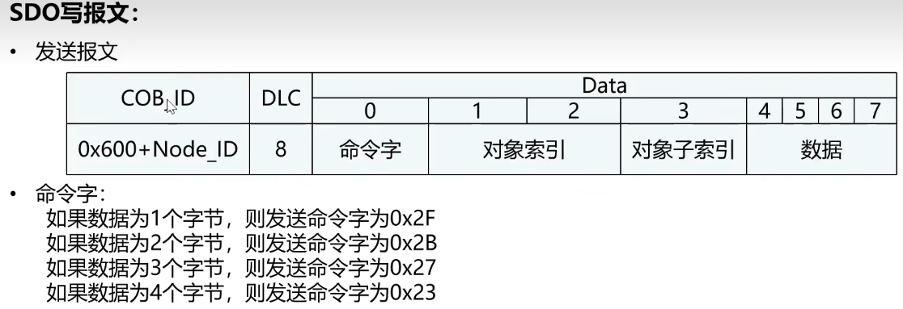
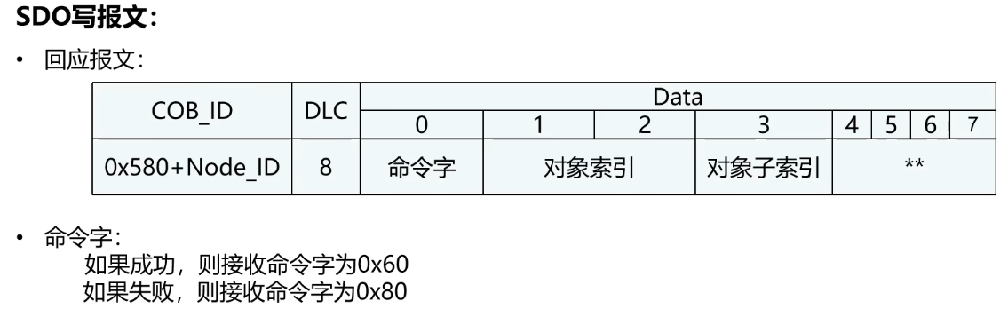
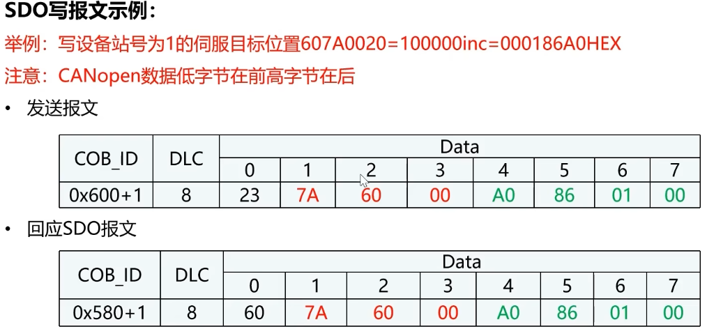

### (7)PDO通讯
* PDO通信是基于生产者/消费者的通讯模式，每个PDO有一个唯一的标识符且可以通过一个节点发送，但有多个节点可以接收。由生产者发送的 PDO称为发送PDO(TPDO)，同样消费者接收的PDO称为接收PDO(即RPDO)。PDO 的接收不需要消费者的确认。
* 发送接受是相对从节点来说的。
* PDO则不使用Index和SubIndex，它是两个CAN(生产者、消费者)节点间约定好传输的数据内容对应哪些对象字典索引，收到数据后就直接读写相应的对象字典索引里的值

#### PDO通讯参数
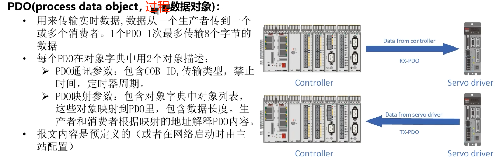
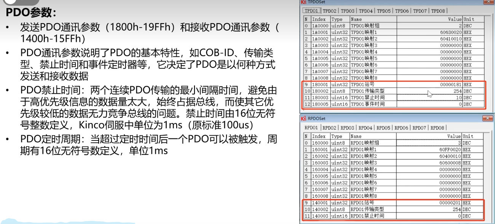
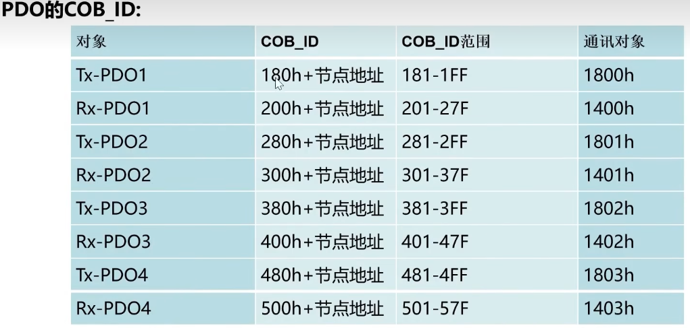
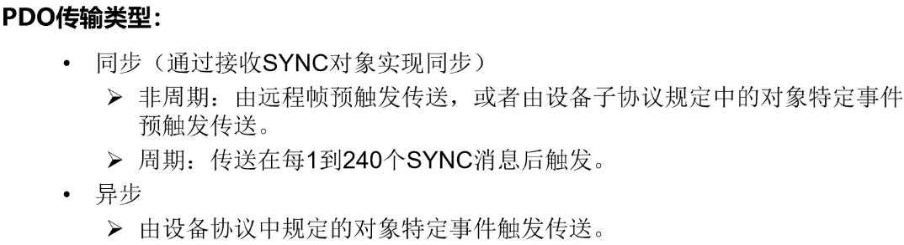
#### PDO映射参数
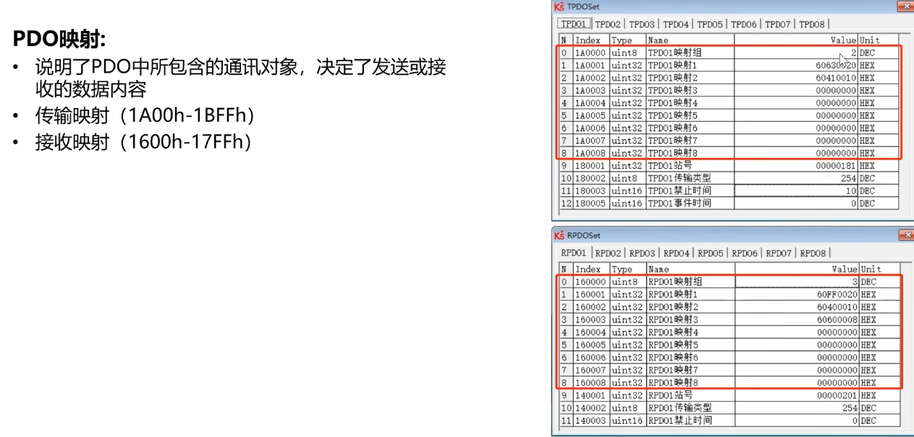
#### PDO报文
**后两位为数据长度：
0x20，表示32，32位4个字节；
0x10，表示16，16位2个字节；
0x08，表示8，8位1个字节**
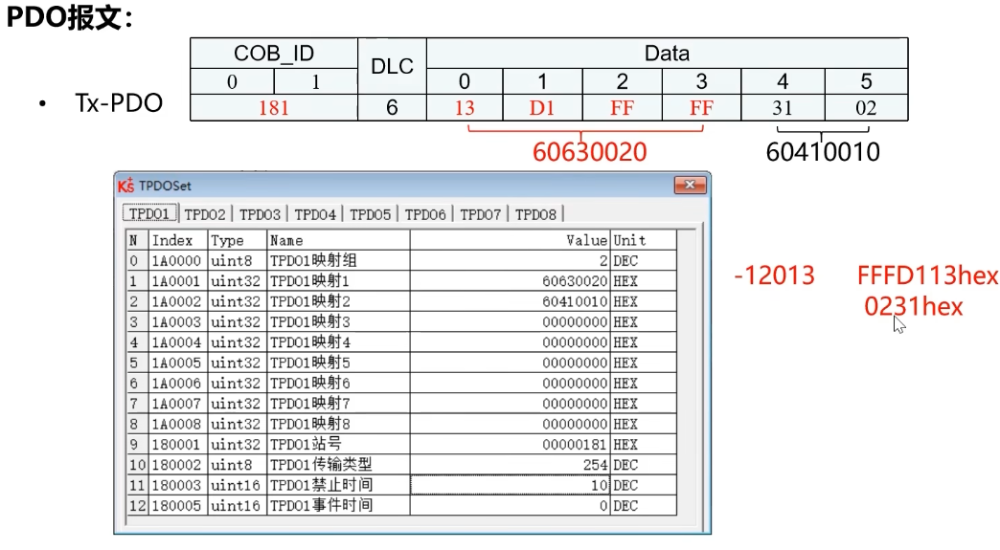
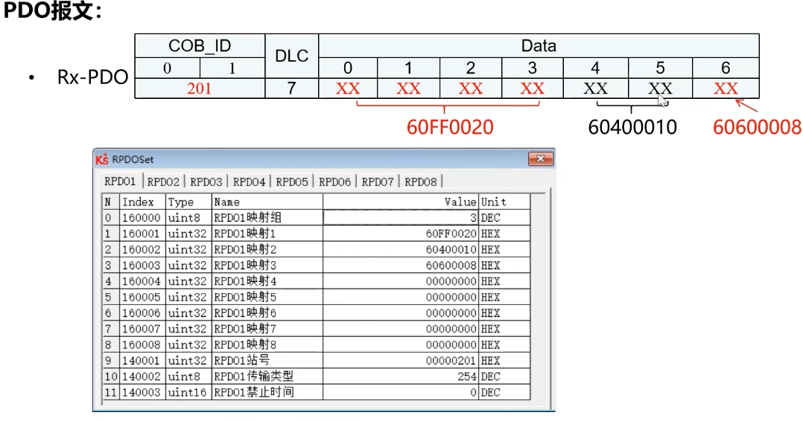

# CAN与CANOPEN对比
CAN（Controller Area Network）和CANopen都是用于实时通信的标准协议，主要应用于工业控制和汽车电子领域。它们之间的区别主要体现在以下几个方面：
1. 功能层次：CAN是一种底层通信协议，提供了数据传输和错误检测等基本功能。而CANopen是基于CAN协议的应用层协议，提供了更高层次的功能，如设备配置、网络管理、数据传输协议等。
2. 应用领域：CAN通常用于连接较简单的节点，如传感器、执行器等，广泛应用于汽车电子、工业控制等领域。而CANopen更多地用于复杂的系统中，如工业自动化、机器人控制等。CANopen提供了更多的特性和功能，适用于大规模网络中的设备间通信和控制。
3. 数据结构：CAN通信基于消息的概念，通过CAN帧进行数据传输。CANopen在此基础上定义了一套特定的对象字典（Object Dictionary）结构，用于描述设备的参数、状态和功能等信息。
4. 网络管理：CANopen提供了强大的网络管理功能，可以支持节点的配置、识别、同步和通信等任务。它定义了一些网络管理对象，可实现网络的动态配置和管理。
5. 处理方式：CAN协议下节点之间的通信是以点对点方式进行的，节点只能与相邻的节点直接进行通信。而CANopen协议允许节点之间集成到一个分布式网络中，节点可以通过多端口和多功能模块进行通信。
6. 功能扩展：CANopen协议允许更多的功能扩展和定制化，例如，可以添加自定义的对象字典、参数设置等，以满足特定应用的需求。而CAN协议的功能扩展相对较少，需要通过自定义的应用层协议进行扩展。
7. 节点类型：CANopen协议定义了多种节点类型，例如，可以将节点分类为Master节点、Slave节点、数据采集节点等。每种节点类型都有不同的通信功能和特点。而CAN协议没有定义节点类型的概念。
8. 设备配置和识别：CANopen协议提供了一种标准的设备配置和识别机制，通过对象字典和标准设置可以轻松地配置和管理节点。而CAN协议本身并没有提供设备配置和识别的机制，需要通过其他方式实现。
9. 通信速率：CAN协议支持多个速率，包括常见的100kbps、250kbps和500kbps等，可以根据具体需求选择不同的速率。而CANopen协议在CAN协议之上可以支持更高速率的通信，如1Mbps或更高。
10. 网络管理：CANopen协议提供了一套通用的网络管理功能，包括节点状态监测、配置管理、故障诊断等。这使得系统的维护和管理变得更加方便和可靠。相比之下，CAN协议本身并没有提供这些网络管理功能。
11. 兼容性：CANopen协议在CAN协议之上增加了一层应用层协议，使得CANopen兼容性较差的设备可以通过适配器实现与CANopen网络的连接。这可以方便地与现有的CAN设备进行集成和通信。
12. CAN是一种底层通信协议，而CANopen是基于CAN的应用层协议。CAN提供基本的数据传输和错误检测功能，而CANopen提供了更高级的功能，如设备配置、网络管理和数据传输协议等，适用于复杂系统中的设备间通信和控制。

