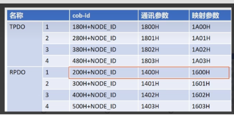

## PDO
在 CANopen 协议中，PDO（Process Data Object，过程数据对象）是用于实时传输工艺／过程数据的核心机制，其设计目标是在总线上以最小开销、高优先级地广播或接收应用层数据。​ PDO 采用生产者–消费者模型，发送方（TPDO）将数据打包到单帧 CAN 报文，接收方（RPDO）无需回应即可接收，最大数据长度为 8 字节，非常适合对时延和带宽要求严格的工业 I/O 通信场景。
**TPDO（Transmit PDO）**：生产者（通常是现场设备）将过程数据打包后发送到总线上的 PDO。
**RPDO（Receive PDO）**：消费者（通常是控制器或其他节点）接收并解析来自 TPDO 的数据。​
**一个节点可以同时拥有多路 TPDO 和 RPDO（最多各 4 路），用于不同数据通道的并行实时传输。**


## PDO工作原理
### 对象字典映射
对象字典中，通过PDO**通信参数**（COB-ID、Transmission Type、Inhibit Time、Event Timer 等）和**映射参数**（映射哪些索引/子索引及位宽）来定义每路PDO的行为和数据布局。
### 报文打包与发送
运行时，固件根据映射表从对象字典读取变量，打包到最多 8 字节的数据域，使用配置好的 COB-ID 发送 CAN 报文。​
### 报文接收与解析
接收端 CAN 控制器中断触发后，将数据域按映射写回对象字典对应变量，应用层即可直接使用最新数据。

## PDO通信参数配置
### 索引分配
|PDO类型|通信参数起始索引|说明|
|------|--------|-------|
|RPDO n|0x1400+n|接收PDO通信参数|
|TPDO n|0x1800+n|发送PDO通信参数|

**其中n=0，1，2，3，分别对应四路PDO**
### 通信参数子索引
|子索引|参数名|含义|
|------|--------|-------|
|1|COB-ID|PDO 的 CAN 报文标识符（含方向位及节点号）|
|2|Transmission Type|触发类型（1–240 = 同步，254 = 事件触发，255 = 抑制定时触发）|
|3|Inhibit Time|抑制时间，单位为 100 µs，防止报文过快发送|
|5|Event Timer|事件定时器，单位 ms；0 = 不定时发送，仅事件触发|
|6|	SYNC Start Value|同步管理：指定在第几个 SYNC 后发送（仅同步PDO）|
### 配置示例
假设节点 ID = 0x05，需要配置 TPDO0，COB-ID = 0x180 + 5 = 0x185，事件触发、10 ms 定时：
```
索引  0x1800.sub 1 (COB-ID)           = 0x185  
索引  0x1800.sub 2 (TransmissionType) = 254      ; 事件触发  
索引  0x1800.sub 3 (InhibitTime)      = 100      ; 100×100 µs = 10 ms  
索引  0x1800.sub 5 (EventTimer)       = 10       ; 10 ms  
```
此后，固件会根据该配置以事件或定时方式发送 TPDO0

## PDO映射参数配置
### 索引分配
|PDO类型|映射参数起始索引|说明|
|------|--------|-------|
|RPDO n|0x1600+n|接收PDO映射参数|
|TPDO n|0x1A00+n|发送PDO映射参数|

**其中n=0，1，2，3，分别对应四路PDO**
### 映射参数子索引格式
SubIndex 0：映射项数量 N
SubIndex 1…N：每项 32 bit 编码，结构：
[15:0] 对象字典索引（Index）
[23:16] 子索引（SubIndex）
[31:24] 数据长度（Bit）

例如将OD[0x2000,1]（32 bit）和 OD[0x2001,0]（16 bit）映射到 TPDO0：
```
0x1A00.sub0 = 2  
0x1A00.sub1 = 0x20000120  ; 0x2000:1, 32 bit  
0x1A00.sub2 = 0x20010010  ; 0x2001:0, 16 bit  
```
### 配置示例
|SubIndex|值|含义|
|------|--------|-------|
|0|2|两个映射项|
|1|0x30000210|OD[0x3000,2]，长度 16 bit|
|2|0x30010020|OD[0x3001,0]，长度 32 bit|

设备固件在打包 PDO 时，会依映射顺序读取这些变量并组成 CAN 数据域 