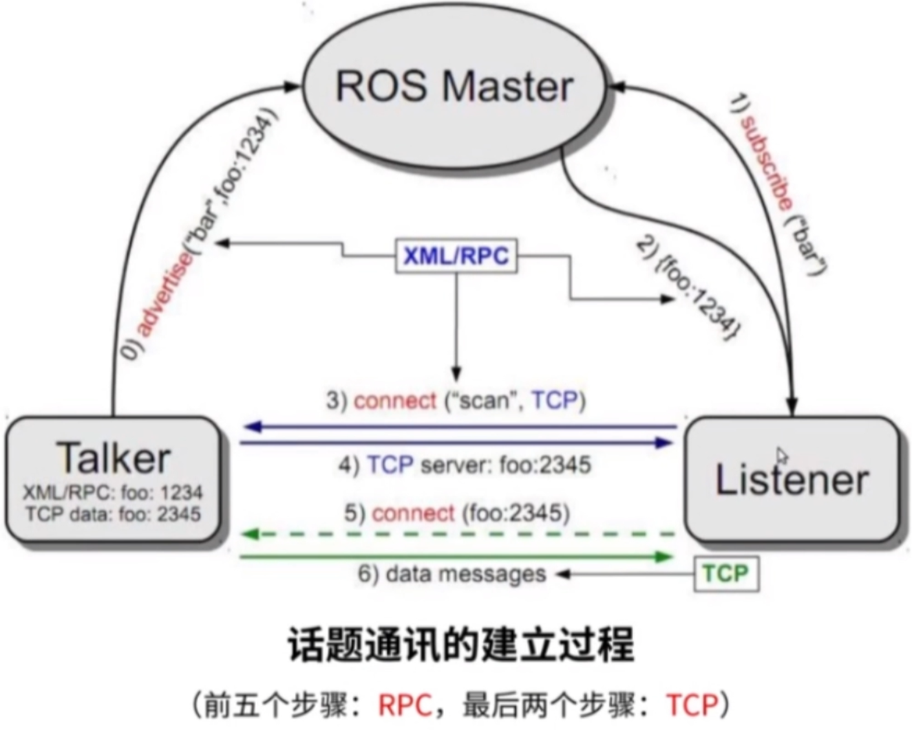
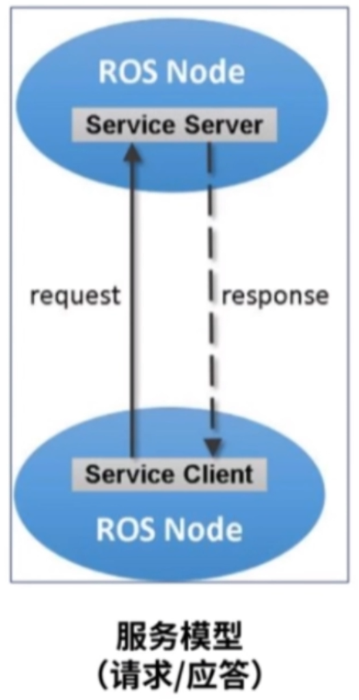
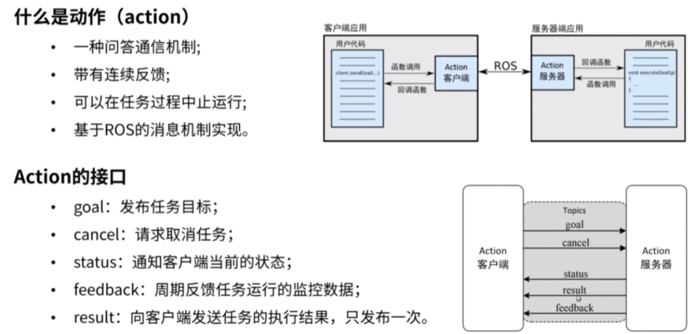

ROS使用第一步：
Ros安装好之后，可以从ros index中sudo apt install ros-neotic-xxxxx的软件包
然后先运行roscore  （ros的核心）
然后重开一个命令行开始rosrun下载的软件包中的节点。 
apt上下载的软件包都是编译好的可执行文件，在opt下ros的share中，ROS运行时需要找到自己依赖的软件包的位置也在里面

也可以从GitHub上下载到工作空间的src中，用catkin自己编译，然后运行。

软件包是ros文件的基础，不过不是所有软件包都有节点，很多软件包是依赖性质的基础包，例如std_msgs消息包等

# ros的简单理解
ROS = 通讯机制+开发工具+应用功能+ROS生态系统

### 通信机制
ros的通信机制是一种松耦合分布式通信。主要概念有  
1、节点：node --软件模块  
2、节点管理器：ros master --控制中心，提供参数管理  
3、话题：topic --异步通信机制，传输message，适用于数据传输 

4、服务：service --同步通信机制，传输请求应答数据，适用于逻辑处理 

5、动作：action，底层就是话题，拥有监控和取消任务功能

### 开发工具
 1、命令行&编译器  
 2、launch文件：通过XML文件实现多节点的配置和启动，自动启动ros master  
 3、TF坐标变换库  
 4、QT工具箱，rqt
 5、Rviz：三维可视化工具 ，显示数据  
 6、gazebo：独立于ROS，但提供了ros接口，三维物理仿真平台，创造数据
 
### 应用功能
1、导航框架   
2、SLAM  
3、Moveit!(机械臂)  
4、SMACH任务级状态机
### ROS生态系统

# 从机械臂视角来看ROS
通信机制：节点、话题通信、服务通信、参数服务器  
开发工具：launch、Rviz、rqt、Gazebo、tf  
应用功能：Moveit!  
生态系统：Moveit api、官方教程、机器人功能包

