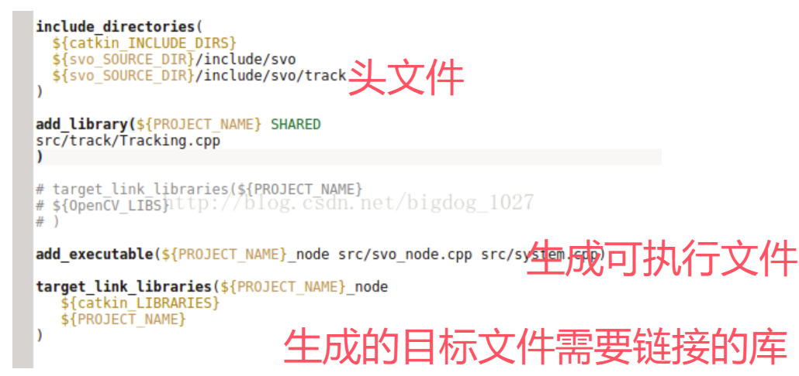

具体操作   
1、首先创建一个工作空间（符合要求的目录结构，简单说就是一个大文件夹）   
Catkin工作空间是创建、修改、编译catkin软件包的目录。catkin的工作空间，直观的形容就是一个仓库，里面装载着ROS的各种项目工程，便于系统组织管理调用。在可视化图形界面里是一个文件夹。我们自己写的ROS代码通常就放在工作空间中。
```
mkdir catkin_ws()      //自己定义工作空间，名称随意
cd catkin_ws
mkdir src
catkin_init_workspace   //初始化之后目录中多了CMakeLists.txt，有这样一个文件也就说明我们当前的路径是一个ROS的工作空间了
cd   ~/catkin_ws
catkin_make   //编译src下面所有功能包的源码，工作空间下会多出build和devel  
```

2、创建功能包（软件包）  
```
Catkin_create_pkg 包名 依赖（一般有rospy roscpp std_msgs）
//创建后src中会出现一个包，包中include放置头文件，src放置功能包代码，
//CMakeLists.txt 和 packages.xml是每个catkin软件包必须要存在的两个文件
 回到工作空间catkin_make 
 ```

3、设置环境变量
每次运行前
```
source ~/catkin_ws/devel/setup.bash
```
或者直接在Home中的.bashrc中添加
```
source ~/catkin_ws/devel/setup.bash
```
所有工作空间都可以   

4、构建一个node



5、运行节点
1、roscore
2、rosrun  软件包名   生成的节点名
