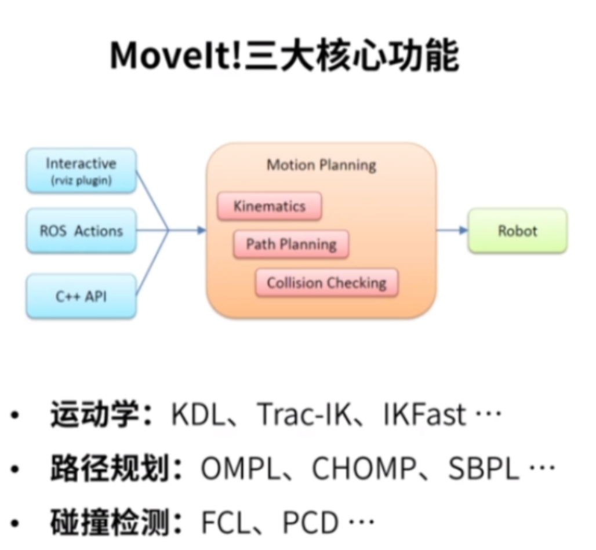
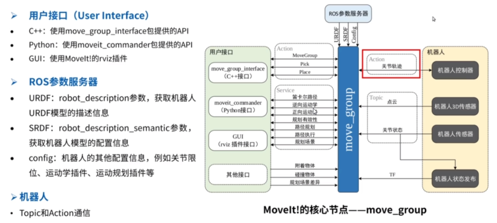

# 学习方法
### 官方教程包moveit_tutorials 
moveit_tutorials 是 MoveIt 官方提供的 ​教程包，旨在帮助用户从零开始学习和掌握 MoveIt 的核心功能。它通过详细的代码示例、文档和演示，指导用户完成机器人运动规划的配置、编程及调试流程，是入门 MoveIt 的必备资源。

https://decyzy.github.io/moveit_tutorials/doc/getting_started/getting_started.html

# Moveit!适用于机械臂

