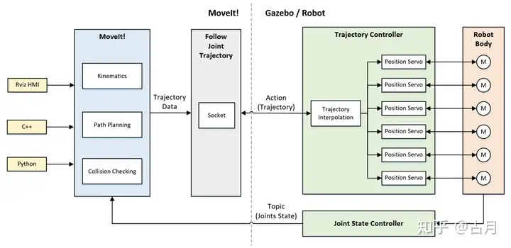

## 机器人动起来的过程
1、ROS功能包跑起来
2、moveit生成的轨迹数据发给真实机器人控制器
3、机器人控制器完成底层控制（伺服控制）
4、控制信号控制电机转动（功率驱动）
**如何将ROS功能包计算得到的数据发给真实机器人并使之运动是问题的关键**

在ROS环境下，不管是移动小车的move_base，还是机械臂的MoveIt!，都是解决ros的功能算法问题。ROS最大的好处就是：我们可以先不关注功能算法的内部实现，通过接口的拼接快速实现系统的原型。所以这里我们需要关注的一个问题是MoveIt!的输入输出接口是什么？

在下边这张图中，我们可以看到MoveIt!核心节点的接口： 
输入：编程API（C++、Python）、GUI（Rviz中的Motion Planning）
输出：关节轨迹（Trajectory）

先不纠结MoveIt!里边干了啥，反正当我们通过程序或者界面指定一个目标位置后，它会规划得到一条运动到目标位置的轨迹，这条轨迹由一系列关节空间的位置组成，接下来，我们要把这条轨迹发给机械臂的控制器。

**ROS MoveIt!控制真实机械臂的一般框架**

1.通过程序或界面设置机械臂运动目标  
2.MoveIt!完成运动规划并输出关节轨迹
3.通过socket接口和控制器连接，将关节轨迹发送给控制器
4.控制器进行插补运算，并周期发送给电机驱动器
5.驱动器完成闭环控制，让电机多、快、好、爽的跟随输入指令
6.控制器反馈实时状态到MoveIt!，Rviz动态显示当前状态

## moveit与ros_control的关系
ros_control 在 MoveIt 将运动轨迹发送给机器人控制器后，负责机器人控制器与硬件层的交互。
当 MoveIt 将轨迹发送给控制器后，后续的指令分解、实时控制、硬件信号转换均由 ros_control 处理。它是连接上层规划与底层硬件的桥梁，确保轨迹精确执行。若系统采用专有控制器，则需定制适配层，此时 ros_control 可能仅起中介作用
**1. ​ros_control 的核心作用**
* ​硬件抽象与控制：ros_control 是 ROS 中用于标准化机器人硬件接口的框架，提供控制器（如位置、速度、力矩控制器）和硬件接口（如 JointStateInterface、EffortInterface）的抽象层。
* ​实时通信：通过硬件资源管理（RobotHW 类）和控制器管理器（ControllerManager），实现与底层硬件的实时通信（如通过 CAN 总线、以太网等）。

**2. ​MoveIt 与 ros_control 的协作流程**
* ​轨迹规划：MoveIt 负责运动规划，生成关节轨迹（JointTrajectory 消息）。
* ​发送轨迹到控制器：MoveIt 将轨迹通过 ROS Topic（如 /joint_trajectory_controller/command）发送给 ros_control 中的控制器（如 joint_trajectory_controller）。
* ​轨迹执行：
  * 控制器处理：ros_control 的控制器将轨迹拆解为时间步长的目标值（位置、速度等），并通过 PID 控制等算法生成底层指令（如电机力矩）。
  * ​硬件接口转发：指令通过硬件接口（如 EffortJointInterface）传递给 RobotHW 实现，最终由具体驱动（如 ros_control_boilerplate 或厂商驱动）转换为硬件信号（如 PWM、CAN 报文）。  

**3. ​硬件交互的标准化与扩展**
* ​通用接口：ros_control 定义了 read() 和 write() 方法，硬件驱动需实现这些接口以周期性读取传感器数据（如编码器）和下发指令。
* ​实时性保障：通过 ROS 实时工具链（如 ros_rt 或 Xenomai 补丁），确保控制循环的实时性（通常 1kHz 频率）。  
* 适配专有硬件：对于专用控制器（如 UR 的 URCaps 或 KUKA 的 KRL），可通过 ros_control 的适配层（如 socket_bridge）封装其私有协议，保持与 ROS 生态兼容。

**4. ​例外情况**
* ​直接硬件控制：若机器人使用非 ros_control 的专用控制器（如 ABB 的 IRC5），MoveIt 可能通过其 SDK 直接通信，此时 ros_control 不参与。
* ​仿真与真实硬件切换：在 Gazebo 等仿真器中，ros_control 的 gazebo_ros_control 插件会替代真实硬件接口，实现无缝切换。