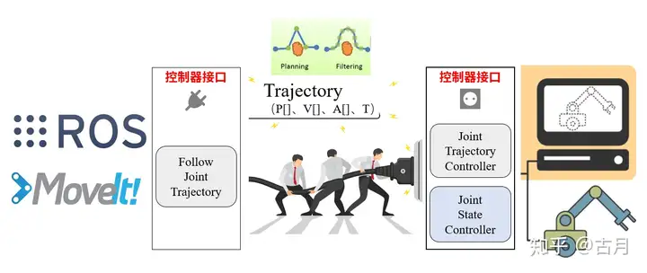

## 机器人动起来的过程
1、ROS功能包跑起来生成规划轨迹
2、数据发给机器人控制器（中央控制器）
3、机器人控制器完成底层控制（伺服控制）
4、控制信号控制电机转动（功率驱动）
5、电机实时反馈状态
**如何将ROS功能包计算得到的数据发给真实机器人并使之运动是问题的关键**

在ROS环境下，不管是移动小车的move_base，还是机械臂的MoveIt!，都是解决ros的功能算法问题。ROS最大的好处就是：我们可以先不关注功能算法的内部实现，通过接口的拼接快速实现系统的原型。所以这里我们需要关注的一个问题是MoveIt!的输入输出接口是什么？

在下边这张图中，我们可以看到MoveIt!核心节点的接口： 
输入：编程API（C++、Python）、GUI（Rviz中的Motion Planning）
输出：关节轨迹（Trajectory）

先不纠结MoveIt!里边干了啥，反正当我们通过程序或者界面指定一个目标位置后，它会规划得到一条运动到目标位置的轨迹，这条轨迹由一系列关节空间的位置组成，接下来，我们要把这条轨迹发给机械臂的控制器。

**ROS MoveIt!控制真实机械臂的一般框架**
***1、moveit将轨迹发给机器人控制器的接口***

***2、逻辑框架***

***3、机器人端ros_control的逻辑***

1.通过程序或界面设置机械臂运动目标(rviz/c++/python)
2.MoveIt!完成运动规划并输出关节轨迹（move_group）
3.通过socket接口和控制器连接，将关节轨迹发送给控制器(moveit->action到机器人控制器)
4.控制器进行插补运算，并周期发送给电机驱动器（ros-control，硬件抽象层）
5.驱动器完成闭环控制，让电机多、快、好、爽的跟随输入指令
6.控制器反馈实时状态到MoveIt!，Rviz动态显示当前状态（joint state）

