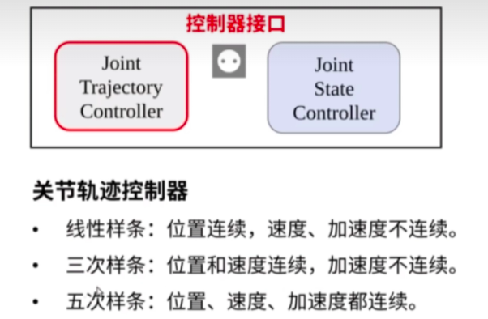

## 机器人动起来的过程
1、ROS功能包跑起来生成规划轨迹
2、数据发给机器人控制器（中央控制器）
3、机器人控制器完成底层控制（伺服控制）
4、控制信号控制电机转动（功率驱动）
5、电机实时反馈状态
**如何将ROS功能包计算得到的数据发给真实机器人并使之运动是问题的关键**

在ROS环境下，不管是移动小车的move_base，还是机械臂的MoveIt!，都是解决ros的功能算法问题。ROS最大的好处就是：我们可以先不关注功能算法的内部实现，通过接口的拼接快速实现系统的原型。所以这里我们需要关注的一个问题是MoveIt!的输入输出接口是什么？

在下边这张图中，我们可以看到MoveIt!核心节点的接口： 
输入：编程API（C++、Python）、GUI（Rviz中的Motion Planning）
输出：关节轨迹（Trajectory）


先不纠结MoveIt!里边干了啥，反正当我们通过程序或者界面指定一个目标位置后，它会规划得到一条运动到目标位置的轨迹，这条轨迹由一系列关节空间的位置组成，接下来，我们要把这条轨迹发给机械臂的控制器。

**ROS MoveIt!控制真实机械臂的一般框架**
***1、moveit将轨迹发给机器人控制器的接口***

***2、逻辑框架***

***3、机器人端ros_control的逻辑***


***4、控制过程***
1.通过程序或界面设置机械臂运动目标(rviz/c++/python)
2.MoveIt!完成运动规划并输出关节轨迹（move_group）
3.通过socket接口和控制器连接，将关节轨迹发送给控制器(moveit->action到机器人控制器)
4.控制器进行插补运算，并周期发送给电机驱动器（ros-control，硬件抽象层）
5.驱动器完成闭环控制，让电机多、快、好、爽的跟随输入指令
6.控制器反馈实时状态到MoveIt!，Rviz动态显示当前状态（joint state）

## 控制器接口配置过程（在生成的config文件中配置yaml和launch文件中）
```
配置注意事项：
    launch文件中节点的关键配置在于 args 参数，需与 YAML 文件中的控制器名称严格匹配。
    例如，若 YAML 中定义了 joint_state_controller 和 arm_position_controller，则 args 应包含这些名称。
    若节点自定义名称与其他节点重复（如 controller_spawner），可能导致 ROS 节点管理器报错。
    建议通过 rosnode list 命令检查运行时的节点名称唯一性。
```
### 1、FollowJointTtaiectory(moveit!)

（1）参数配置(yaml)
```yaml
controller_list:  # 控制器列表
  - name: manipulator_controller  # 控制器名称
    type: FollowJointTrajectory # 控制器类型
    joints: # 关节列表
      - joint1
      - joint2
      - joint3
      - joint4
      - joint5
      - joint6
      - joint7    
```
（2）控制器启动(launch)
```xml
<launch>
  <!-- 指定使用 MoveIt 内置的简单控制器管理器（MoveItSimpleControllerManager），该管理器默认支持 FollowJointTrajectory 类型的控制器，
  能够自动加载/卸载控制器，并通过 ROS action 接口与硬件控制器通信-->
  <arg  name="moveit_controller_manager" default="moveit_simple_controller_manager/MoveItSimpleControllerManager"/>
  <param name="moveit_controller_manager" value="$(arg moveit_controller_manager)" />
  
  <!--静态传参，无法改变控制器类型
  <param name="moveit_controller_manager" value="moveit_simple_controller_manager/MoveItSimpleControllerManager" />
  <!-- 明确 MoveIt 需要控制的关节组及其对应的 ROS action 接口（FollowJointTtaiectory） -->
  <rosparam file="$(find manipulator_moveit_config)/config/xxxxxxx.yaml" />
  <!-- 配置底层控制器参数（JointTtaiectoryController），文件会被 controller_manager 加载，用于初始化 ROS control 框架下的控制器 -->
  <rosparam file="$(find manipulator_moveit_config)/config/xxxxxxx.yaml" />
</launch>
```
### 2、JointTtaiectoryController(gazebo/robtot)

***启动一个manipulator_controller控制器，控制器用于接收轨迹并完成每个关节的插补***
（1）参数配置(yaml)
```yaml
my_robot_name:  # 机器人名称
  manipulator_controller:  # 机器人控制器配置
  type: position_controllers/JointTrajectoryController  # 控制器类型
  joint:  # 关节列表
    - joint1
    - joint2
    - joint3
    - joint4
    - joint5
    - joint6
    - joint7
  gains: # 控制器参数
    joint1: # 关节1
      p: 1000.0 # 比例增益
      i: 0.0  # 积分增益
      d: 0.0 # 微分增益
      i_clamp: 0.0 # 积分限幅
   # 其他关节参数·
```
（2）控制器启动(launch)
```xml
<?xml version="1.0"?>
<launch>
  <!-- Load joint controller configurations from YAML file to parameter server -->
  <rosparam file="$(find manipulator_moveit_config)/config/xxxxxx.yaml" command="load"/>

  <!-- Load the controllers，节点名称可自定义，节点的名称仅用于日志输出和调试标识，不影响功能 -->
  <node name="controller_spawner" pkg="controller_manager" type="spawner" respawn="false"
    output="screen" args="manipulator_controller "/>
</launch>
```
### 3、JointStateController(gazebo/robtot)

（1）参数配置(yaml)
```yaml
my_robot_name:  # 机器人名称
    joint_state_controller: # 发布关节状态
        type: joint_state_controller/JointStateController # 控制器类型
        publish_rate: 50 # 发布频率
```
（2）控制器启动(launch)
```xml
<launch>
  <!-- 将关节控制器的配置参数加载到参数服务器中 -->
  <rosparam file="$(find manipulator_moveit_config)/config/xxxxxx.yaml" command="load"/>
  <!-- Spawn the Gazebo ROS controllers，节点名称可自定义，节点的名称仅用于日志输出和调试标识，不影响功能 -->
  <node name="gazebo_controller_spawner" pkg="controller_manager" type="spawner" respawn="false" output="screen" args="joint_state_controller" />
  <!-- 运行robot_state_publisher节点，发布tf -->
  <node name="robot_state_publisher" pkg="robot_state_publisher" type="robot_state_publisher" respawn="true" output="screen" />
</launch>
```

## moveit和gazebo仿真启动过程
1、首先启动gazebo(用一个launch)
```xml
<launch>
  <!-- Gazebo options -->
  <arg name="gazebo_gui" default="true" doc="Start Gazebo GUI"/>
  <arg name="paused" default="false" doc="Start Gazebo paused"/>
  <arg name="world_name" default="worlds/empty.world" doc="Gazebo world file"/>
  <arg name="world_pose" default="-x 0 -y 0 -z 0 -R 0 -P 0 -Y 0" doc="Pose to spawn the robot at"/>
  <arg name="initial_joint_positions" default=" -J joint1 0 -J joint2 0 -J joint3 0 -J joint4 0 -J joint5 0 -J joint6 0 -J joint7 0" doc="Initial joint configuration of the robot"/>

  <!-- Start Gazebo paused to allow the controllers to pickup the initial pose -->
  <include file="$(find gazebo_ros)/launch/empty_world.launch" pass_all_args="true">
    <arg name="paused" value="true"/>
  </include>

  <!-- Set the robot urdf on the parameter server -->
  <param name="robot_description" textfile="$(find manipulator)/urdf/manipulator.urdf" />

  <!-- Unpause the simulation after loading the robot model -->
  <arg name="unpause" value="$(eval '' if arg('paused') else '-unpause')" />

  <!-- Spawn the robot in Gazebo -->
  <node name="spawn_gazebo_model" pkg="gazebo_ros" type="spawn_model" args="-urdf -param robot_description -model robot $(arg unpause) $(arg world_pose) $(arg initial_joint_positions)"
    respawn="false" output="screen" />
</launch>
```
2、启动JointStateController的launch
3、启动JointTtaiectoryController的launch
4、启动FollowJointTtaiectory的launch