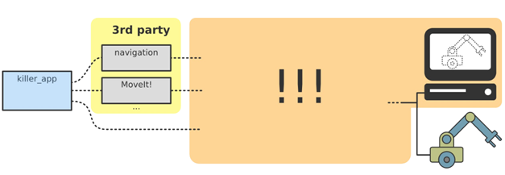
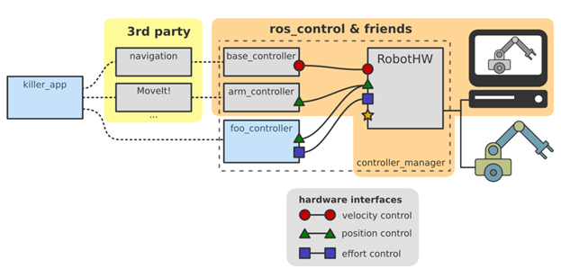
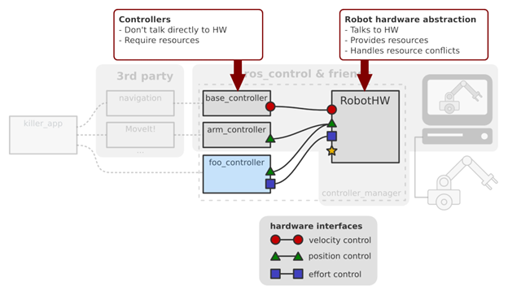
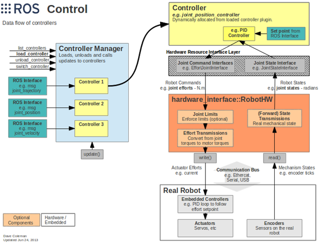
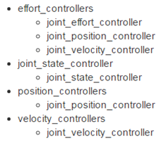
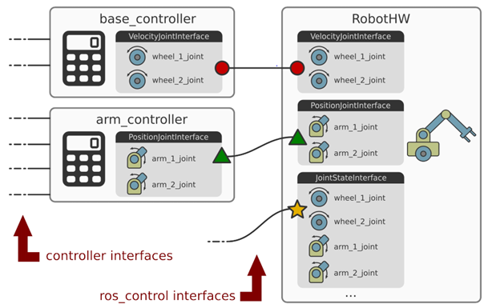
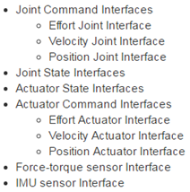
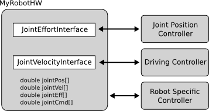

## ros_control说明

ROS中提供了丰富的机器人应用：SLAM、导航、MoveIt......但是你可能一直有一个疑问，这些功能包到底应该怎么样用到我们的机器人上，也就是说在应用和实际机器人或者机器人仿真器之间，缺少一个连接两者的东西。（3rd party 第三方库）

ros_control就是ROS为用户提供的应用与机器人之间的中间件，包含一系列控制器接口、传动装置接口、硬件接口、控制器工具箱等等，可以帮助机器人应用快速落地，提高开发效率。

### ros_control总体框架
1、针对不同类型的控制器（底盘、机械臂等），ros_control可以提供多种类型的控制器，但是这些控制器的接口各不相同，为了提高代码的复用率，ros_control还提供一个硬件的抽象层Robot hardware abstraction，硬件抽象层负责机器人硬件资源的管理，而controller从抽象层请求资源即可，并不直接接触硬件。

2、ros_control的数据流图，可以更加清晰的看到每个层次包含的功能：
* Controller Manager：每个机器人可能有多个controller，所以这里有一个控制器管理器的概念，提供一种通用的接口来管理不同的controller。controller manager的输入就是ROS上层应用的输出。
* controller：controller可以完成每个joint的控制，请求下层的硬件资源，并且提供了PID控制器，读取硬件资源接口中的状态，在发布控制命令。
* Hardware Rescource：为上下两层提供硬件资源的接口。
* RobotHW：硬件抽象层和硬件直接打交道，通过write和read方法来完成硬件的操作，这一层也包含关节限位、力矩转换、状态转换等功能。
* Real Robot：实际的机器人上也需要有自己的嵌入式控制器，接收到命令后需要反映到执行器上，比如接收到位置1的命令后，那就需要让执行器快速、稳定的到达位置1。

二、Controllers
ros_controllers这个功能包提供了已有的一些controllers：

当然，我们也可以根据自己的需求，创建需要的controller，然后通过controller来管理自己创建的controller，可以参考https://github.com/ros-controls/ros_control/wiki/controller_interface

三、Hardware Interface
Hardware Interface是controller和RobotHw沟通的接口，基本上和controllers的种类是对应的，同样可以自己创建需要的接口，可以参考：https://github.com/ros-controls/ros_control/wiki/hardware_interface
