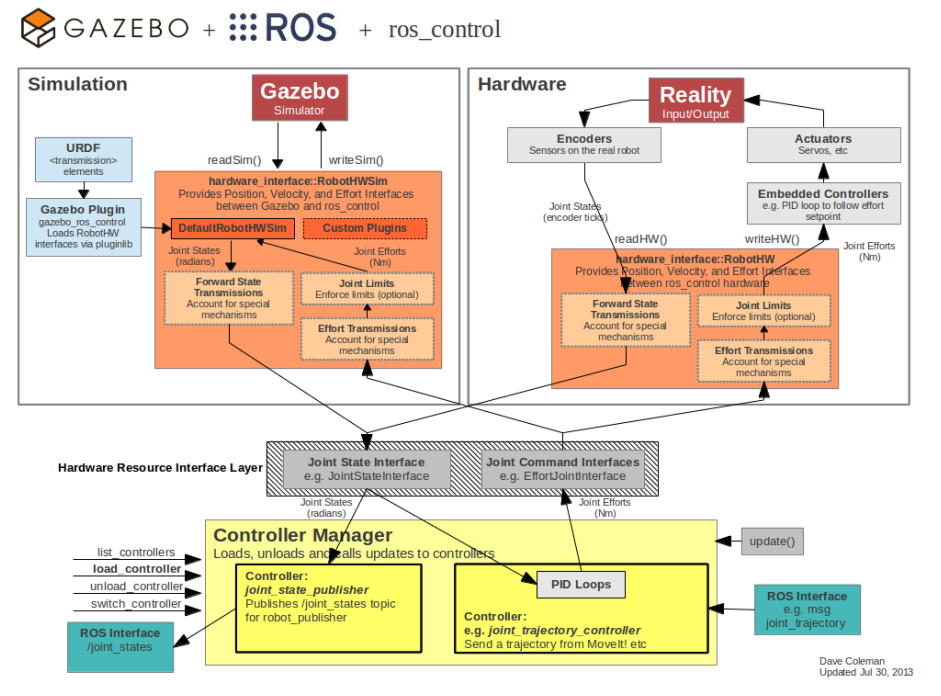

## moveit与ros_control的关系

ros_control 在 MoveIt 将运动轨迹发送给机器人控制器后，负责机器人控制器与硬件层的交互。
当 MoveIt 将轨迹发送给控制器后，后续的指令分解、实时控制、硬件信号转换均由 ros_control 处理。它是连接上层规划与底层硬件的桥梁，确保轨迹精确执行。若系统采用专有控制器，则需定制适配层，此时 ros_control 可能仅起中介作用
**1. ​ros_control 的核心作用**
* ​硬件抽象与控制：ros_control 是 ROS 中用于标准化机器人硬件接口的框架，提供控制器（如位置、速度、力矩控制器）和硬件接口（如 JointStateInterface、EffortInterface）的抽象层。
* ​实时通信：通过硬件资源管理（RobotHW 类）和控制器管理器（ControllerManager），实现与底层硬件的实时通信（如通过 CAN 总线、以太网等）。

**2. ​MoveIt 与 ros_control 的协作流程**
* ​轨迹规划：MoveIt 负责运动规划，生成关节轨迹（JointTrajectory 消息）。
* ​发送轨迹到控制器：MoveIt 将轨迹通过 ROS Topic（如 /joint_trajectory_controller/command）发送给 ros_control 中的控制器（如 joint_trajectory_controller）。
* ​轨迹执行：
  * 控制器处理：ros_control 的控制器将轨迹拆解为时间步长的目标值（位置、速度等），并通过 PID 控制等算法生成底层指令（如电机力矩）。
  * ​硬件接口转发：指令通过硬件接口（如 EffortJointInterface）传递给 RobotHW 实现，最终由具体驱动（如 ros_control_boilerplate 或厂商驱动）转换为硬件信号（如 PWM、CAN 报文）。  

**3. ​硬件交互的标准化与扩展**
* ​通用接口：ros_control 定义了 read() 和 write() 方法，硬件驱动需实现这些接口以周期性读取传感器数据（如编码器）和下发指令。
* ​实时性保障：通过 ROS 实时工具链（如 ros_rt 或 Xenomai 补丁），确保控制循环的实时性（通常 1kHz 频率）。  
* 适配专有硬件：对于专用控制器（如 UR 的 URCaps 或 KUKA 的 KRL），可通过 ros_control 的适配层（如 socket_bridge）封装其私有协议，保持与 ROS 生态兼容。

**4. ​例外情况**
* ​直接硬件控制：若机器人使用非 ros_control 的专用控制器（如 ABB 的 IRC5），MoveIt 可能通过其 SDK 直接通信，此时 ros_control 不参与。
* ​仿真与真实硬件切换：在 Gazebo 等仿真器中，ros_control 的 gazebo_ros_control 插件会替代真实硬件接口，实现无缝切换。

## ros_control说明
ROS中提供了丰富的机器人应用：SLAM、导航、MoveIt......但是你可能一直有一个疑问，这些功能包到底应该怎么样用到我们的机器人上，也就是说在应用和实际机器人或者机器人仿真器之间，缺少一个连接两者的东西。（3rd party 第三方库）

ros_control就是ROS为用户提供的应用与机器人之间的中间件，包含一系列控制器接口、传动装置接口、硬件接口、控制器工具箱等等，可以帮助机器人应用快速落地，提高开发效率。

### ros_control总体框架
1、针对不同类型的控制器（底盘、机械臂等），ros_control可以提供多种类型的控制器，但是这些控制器的接口各不相同，为了提高代码的复用率，ros_control还提供一个硬件的抽象层Robot hardware abstraction，硬件抽象层负责机器人硬件资源的管理，而controller从抽象层请求资源即可，并不直接接触硬件。

2、ros_control的数据流图，可以更加清晰的看到每个层次包含的功能：
* Controller Manager：每个机器人可能有多个controller，所以这里有一个控制器管理器的概念，提供一种通用的接口来管理不同的controller。controller manager的输入就是ROS上层应用的输出。
* controller：controller可以完成每个joint的控制，请求下层的硬件资源，并且提供了PID控制器，读取硬件资源接口中的状态，在发布控制命令。
* Hardware Rescource：为上下两层提供硬件资源的接口。
* RobotHW：硬件抽象层和硬件直接打交道，通过write和read方法来完成硬件的操作，这一层也包含关节限位、力矩转换、状态转换等功能。
* Real Robot：实际的机器人上也需要有自己的嵌入式控制器，接收到命令后需要反映到执行器上，比如接收到位置1的命令后，那就需要让执行器快速、稳定的到达位置1。

二、Controllers
ros_controllers这个功能包提供了已有的一些controllers：

当然，我们也可以根据自己的需求，创建需要的controller，然后通过controller来管理自己创建的controller，可以参考https://github.com/ros-controls/ros_control/wiki/controller_interface

三、Hardware Interface
Hardware Interface是controller和RobotHw沟通的接口，基本上和controllers的种类是对应的，同样可以自己创建需要的接口，可以参考：https://github.com/ros-controls/ros_control/wiki/hardware_interface
