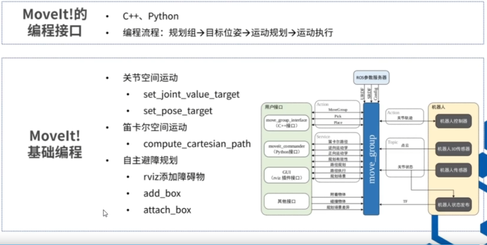
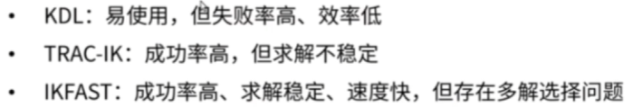
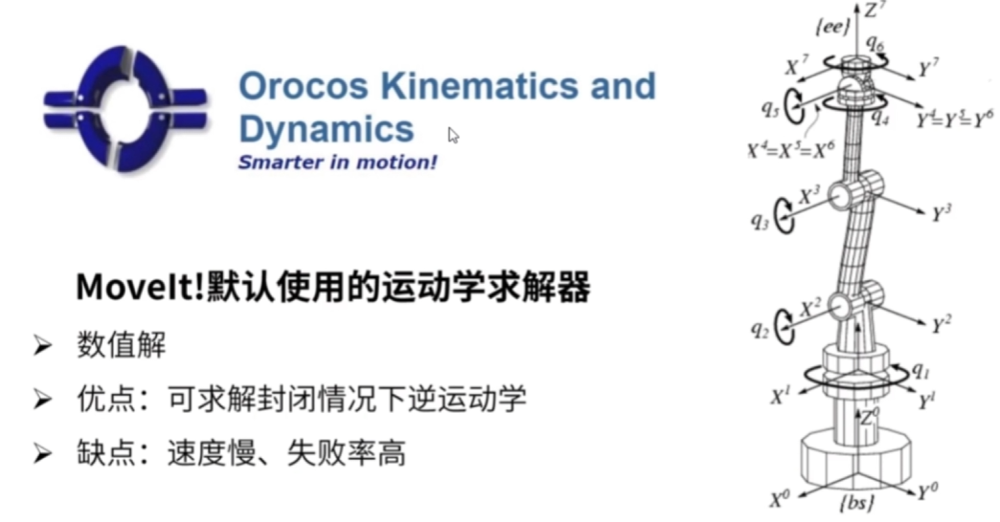
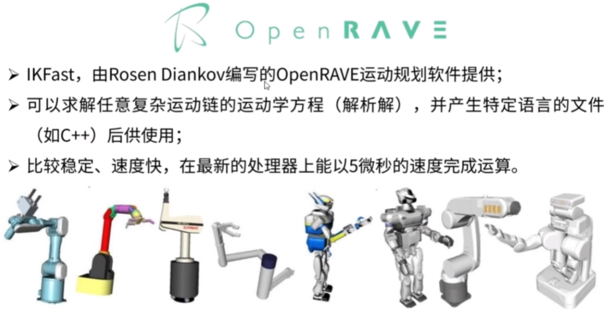

## 1、moveit编程的逻辑是什么

## 2、流程
1、先运行配置好的demo.launch
2、运行自己写好的节点

    tips：注意基坐标系和世界坐标系的偏移，注意不同版本的函数差异。

## 3、更换运动学插件
**ros默认使用KDL可以更换为trac_ik或者ikfast等**

1、KDL

2、TRAC_IK
还是数值解
3、IKFast

## 4、moveit规划的结果
1、MoveIt原生轨迹的局限性
* MoveIt中的plan规划的轨迹通常不能直接发送给机器人执行，需根据实际机械臂的控制接口和硬件特性进行适配或优化。
* MoveIt默认生成的轨迹时间戳是非等步长的（如网页1中示例轨迹的时间间隔从0.3秒到3秒不等），而大多数机械臂需要固定控制周期​（例如1ms）的等时指令流。直接下发会导致运动不连续或执行失败，相邻路点的关节角度、速度、加速度变化较大，直接执行可能引发机械臂剧烈抖动或触发过载保护。
* 真实机械臂通常需要特定格式的指令（如关节角度序列或末端位姿），而MoveIt的RobotTrajectory消息包含冗余数据（如加速度、时间戳），需提取并转换后才能匹配硬件接口。

2、适配方案
* ​轨迹重采样与插补，通过算法（如三次样条）对原生轨迹进行插补，生成等时间间隔的路径点。

* ​控制器接口配置
​Action接口适配：通过配置FollowJointTrajectory类型的action接口，将轨迹拆解为机械臂控制器可识别的关节目标序列。
​PID参数调优：在控制器配置文件中设置关节的PID增益，确保轨迹跟踪的稳定性和精度。

3、应用流程
* ​步骤一：通过MoveIt规划生成原始轨迹，提取关节角度序列和时间戳。
* ​步骤二：使用插补算法或过滤器生成等时指令流。  
* 步骤三：通过机械臂SDK或ROS控制器接口（如ros_control）发送指令。

