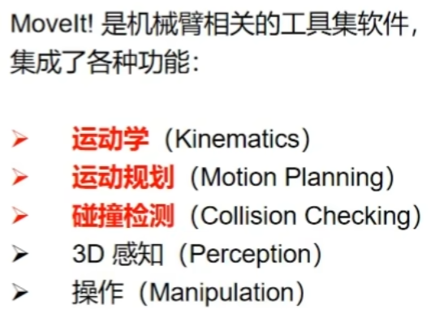

## 创建URDF模型 
下载ros soildworks的工具
## 使用moveit! Setup Assistant工具生成配置文件
*  将urdf放在工作空间下,可作为一个功能包，或者功能包下的文件夹
*  roslaunch moveit_setup_assiatant  setup_assistant.launch 生产的文件可以作为src下的一个功能包
## 驱动
  * 添加robotmodel
  * 添加motionplanning 
## 控制
 路径规划、轨迹规划，rviz显示
