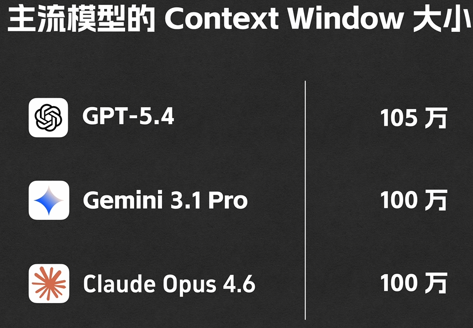
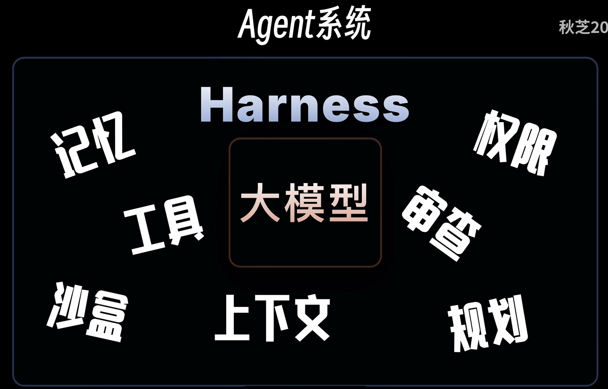
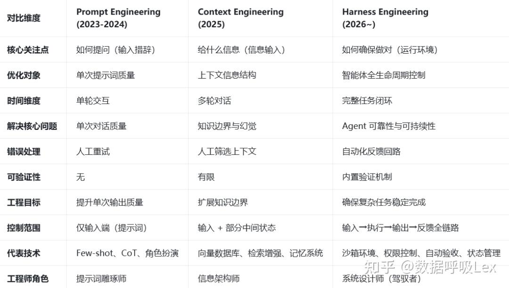
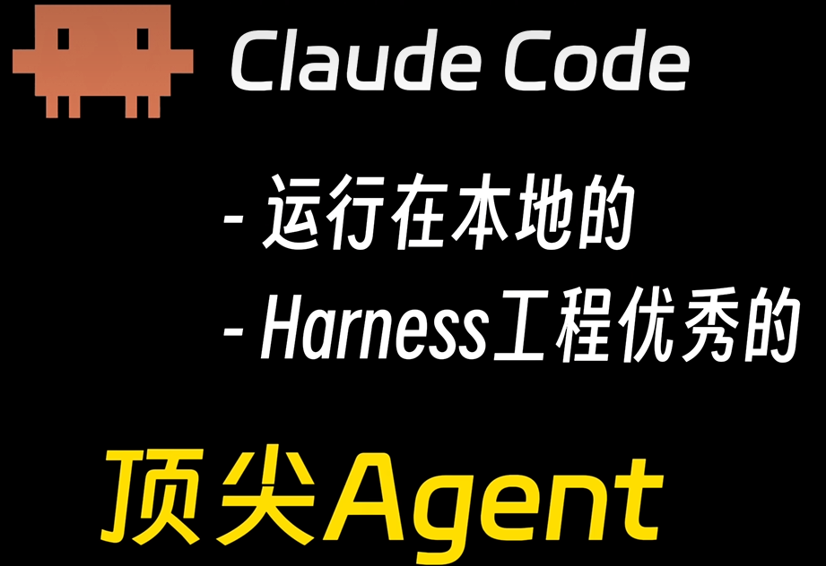

# 一、大模型

**大模型，全称大规模预训练人工智能模型，是依托海量数据训练、拥有巨量参数的深度学习模型。**
* 参数规模大：百亿、千亿级神经网络参数，模拟人脑神经元运算
* 预训练基底：先用全网文本、图像、音视频等海量数据完成基础学习
* 通用能力强：可对话、创作、推理、翻译、识图、写代码，适配多场景
* 深度学习驱动：依靠算法自主理解、生成内容，具备泛化思考能力

>大模型：统称所有超大参数 AI 模型，包含语言、图像、多模态等全部类型
>平时说的大模型，大多默认指LLM(Large Language Model大语言模型)

# 二、基础概念
**1、Token**：
>与AI大模型进行交互时，问题会首先被拆分后编码，可以理解为一句话拆成一个一个的词，这些词有大模型事先规定好的编码，可以理解为也就是这个词的身份证，然后将这一串身份证输入大模型，大模型输出的也是一串编码，再通过映射转换为一个一个词。这是一个将问题编码抛给大模型，然后大模型的回答解码成问题的过程。这其中每一个编码就可以理解为一个Token，翻译为**词元**。

>词元编码规则是模型出厂就固定好的预设码表；所有文字统一按这套固定规则切成 token、转成数字；不同大模型码表不一样，不能通用；切词、编码、解码全程按既定规则机械执行，不会临时改动。

* 定义：模型处理文本的最小单位（字、词、词根、标点）。
* 换算：中文≈1.6–2 字 / Token；英文≈0.75 单词 / Token。
* 用途：计费 + 算力消耗（ChatGPT 按 Token 收费）。
* 示例：“我爱吃苹果”→拆分：我、爱吃、苹果 → 3 个 Token。

**2、Context**：
>大模型每次处理任务时接收到的信息总和。大模型的临时记忆体，即记录上下文的信息和其他信息的总和。

***Context Window***：Context能容纳的最大**Token**数量。

**3、Prompt**：
>就是提问的问题。大模型问题的提示词，把话说清楚，让大模型能好理解。

***User Prompt***：用户提示词，提问的词
***System Prompt***：系统提示词，模型预制的规则

**4、Tool**：
>本质是一个函数，工具，让大模型能理解并感知外部环境，例如你要问天气，大模型本身推理不出来天气，只能调用相关Tool去查询，然后将结果返回给提问者。

**5、MCP**：
>MCP（Model Context Protocol），中文叫模型上下文协议，是 2024 年底由 Anthropic 推出的开放标准接口，用来统一大模型和外部世界的连接方式。MCP 不是模型，不是功能，而是一套 “通用插头标准”，让大模型能安全、标准化、低成本地连上数据库、文件、API 和各种工具，是现在做 AI Agent、长上下文、企业知识库的关键基础设施。

>MCP = 大模型的 USB-C 接口让任何工具 / 数据库 / 文件系统，都能 “即插即用” 地连到大模型。工具开发者只需要按这个标准开发工具，所有支持MCP的平台就都可以使用这个工具了。

**6、Agent**：
AI 智能体（Agent）：能自己思考、自主规划、主动干活的 AI。自己拆解任务、调用工具、一步步做完事。不再是一问一答的模式。
>思考规划：拆分复杂任务
>工具调用：联网、查数据、运行程序、读写文件
>循环执行：做完核对，没完成继续做

Agent是智能体框架 / 程序，负责思考规划、拆解任务、调用工具、流转逻辑，可自由切换接入不同模型：Claude、GPT、通义、本地开源模型均可适配，一套 Agent 流程，换模型接口就能切换算力来源，框架自身不带模型权重，仅做请求收发与任务调度

**7、Agent skill**：
>提前写好，给agent的一份说明文档，个人理解是为按需调用的高级***System Prompt***，规定agent做事的步骤和规则。

**8、Harness**：
>Harness，就是除了 LLM 本身之外，让 Agent 真正能干活的一切基础设施。简洁定义：Agent = LLM + Harness。Harness 是除 LLM 本体外，支撑 Agent 完成生产任务的全部基础设施与工程体系的总和。它并非优化 Prompt 或升级模型，而是通过构建模型运行的环境、机制、规则与边界，实现 AI 智能的工程化落地。

# 三、AI关键概念的关系
**1、Agent与Harness**
>Agent = Model + Harness
Agent 是完整智能体，Harness 是其非模型的支撑与执行框架。

* Agent（智能体）：能感知环境、自主决策、调用工具、完成目标的完整行为主体。
* Model（模型）：LLM 等基础模型，负责核心推理、理解与生成（“大脑”）。
* Harness（驾驭框架 / 执行层）：模型之外的所有工程化支撑，含编排、工具调用、记忆、状态管理、上下文组装、验证与安全边界（“身体 + 控制系统”）。
>Model = 赛车引擎（强动力但无法单独行驶）
Harness = 底盘、方向盘、刹车、导航、车身（让引擎成为可上路的车）
Agent = 完整赛车（引擎 + 整车系统）

**2、Prompt、Context、Harness**
>Prompt：一句话怎么写模型才懂
Context：给模型什么背景资料
Harness：模型接到任务后如何工作（拆任务、调工具、记状态、验结果）。

时间轴 ──────────────────────────────────────────▶
Harness 一直运行
  │
  ├─ 第1轮：组装 Context₁ → 塞入 Prompt₁ → 调用模型
  │         ← 模型输出 → 执行工具 → 得到结果
  │
  ├─ 第2轮：组装 Context₂（含上轮历史+工具结果）→ 塞入 Prompt₂
  │         ← 模型输出 → ...
  │
  └─ 第N轮：直到任务完成或达到终止条件

> 类比：一场考试
Prompt  = 这道题的题目
Context = 考生桌上摆的所有东西（题目 + 草稿纸 + 参考资料 + 之前做过的题）
Harness = 考场规则 + 监考老师（决定什么时候发卷、翻页、交卷、继续下一轮）

**Agent的发展历史是智能体让模型从“会说话的文本生成器”进化为“能自主完成任务的智能体”**
* 阶段一：提示词工程（Prompt Engineering）。
核心问题是“怎么跟模型说话”。开发者精心雕琢指令、使用 Few-shot 示例、Chain-of-Thought 引导，但这种实践单次交互、无状态，更像是手艺而非工程。
* 阶段二：上下文工程（Context Engineering）。
核心问题变为“模型应该看到什么”。开发者从“用户”转变为“Agent Builder”，开始系统性地设计动态上下文系统（知识库、工具调用、记忆管理），将模型当作一个“黑盒”来输入信息。
* 阶段三：Harness Engineering（驾驭工程）。
核心问题升维为“整个环境应该如何运作”。开发者不再是被动地为模型“喂料”，而是主动地为模型构建一个可运行、可约束、可验证的工作环境。这个环境，就是 Harness。

# 四、2026年好用的Agent
## 1、Claude Code

**使用方式：Cursor + CC**
>Cursor 不只是普通代码编辑器，它是「带 AI Agent 的 IDE」（VS Code 加强版 + 内置 AI）。Cursor = VS Code + 强 AI 助手 + 内置 Agent，不是 Notepad++ 那种 “只负责高亮” 的编辑器。
>Claude Code 不需要 Cursor 也能跑，两者是互补、可分开用，也可以一起用。它是一个独立程序：你在任意终端（系统终端、VS Code 终端、Cursor 终端）输入 claude 就能用。

**Cursor和CC的关系** 
* Cursor 内置两套核心 —— 自研 Composer + 第三方 Claude/GPT 等，默认用 Claude 与自家 Composer。Cursor 里的 Claude = 在 Cursor 这个编辑器里，调用 Anthropic 的 Claude 模型（Sonnet/Opus）来聊天、补代码、做简单修改。
* Claude Code = Anthropic 官方出的独立终端 Agent 工具，专门用来全自动干活（读库、多文件修改、跑命令、Git、测试、部署）。
* Claude Code 有桌面端，但它是 “AI 执行器”；Cursor 是 “带 AI 的编辑器”。日常编码用 Cursor 更顺手、更高效、更省钱；大任务再用 Claude Code，不用单独开桌面端。